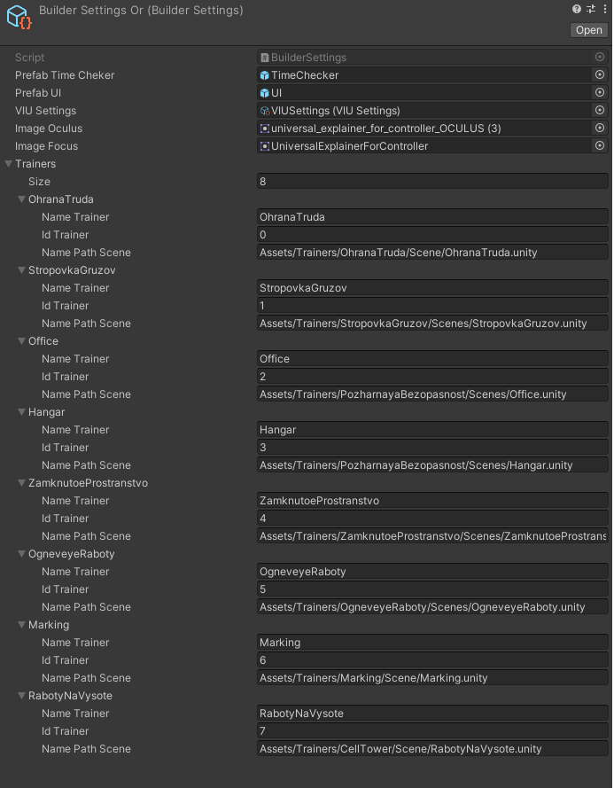

# Builder

Модуль отвечающий за настройку конвейера билдов. Создаем билды с требуемыми настройками для различных платформ (Steam, Oculus, Vive) и типов распротсранения (Free, Premium).
В SO BuilderSettings необходимо заполнить поля 
PrefabTimeCheker-префаб TimeCheker 
PrefabUI-префаб UI
VIUSettings-SO VIU настроек
Image Oculus-картинка для контроллеров Окулус 
Image Focus-картинка для контроллеров Фокус
Trainers-задаем колличество тренажеров после ппод каждый тренажер появляются поля:
  - NameTrainers-имя тренажера равно имя проекта 
  - idTrainers-id тренажера устанавливается в MessageControllerPlug
  - NamePatchScene-путь до сцены которая будет включатся в тренажера

Для того что бы запустить конвейер из командной строки необходимо ввести строку (пример): 
C:\Users\Ariestellar>"C:\Program Files\Unity\Hub\Editor\2020.1.17f1\Editor\Unity.exe" -batchmode -executeMethod ContinuousDevelopment.Builder.StartConveyor -logFile ./Logs/unity.log
в batchmode 

### Поля:

- List<string> scenesForBuild - итоговый пул сцен для билда перед билдом аккумулирует в себя необходимые сцены (обязательные и сцену для конкретного тренажера)
- List<string> requiredScenes - обязательные сцены для всех тренажеров (всегда должны добавлятся во все тренажеры SpawnMenu, MainScene, SplashScene)
- BuildTarget currentSelectTargetPlatform - текущая выбранная платформа, для отслеживания статуса переключения платформы проекта (Android, Standartalone)
- LocalBuildTarget currentSelectLocalTargetPlatform - выбранная локальная платформа (Steam, Oculus, Vive) на основе ее выбора применяются все остальные настройки
- LicenseType distributionVersion - выбранная версия распространения продукта (Free, Premium)
- BuilderSettings builderSettings - необходимые настройки для конвейера билдов 
- int currentConveyorTrainers - текущий тренажер по порядку в конвейере который подготавливается на данный момент инкременируется при окончании всех билдов для предыдущего тренажера
- int callbackOrder - поле от реализации интерфейса IPostprocessBuildWithReport нигде не используется

### Методы:

- StartConveyor - Стартует конвейер билдов(запускает первую итерацию), в нем задаем настройки общие для всех тренажеров (название компании, обязательные сцены, получение настроек билда)
- OnPostprocessBuild - Обратный вызов по окончанию сборки от реализации интерфейса IPostprocessBuildWithReport в нем определяем очередность билда тренажера 
- PreparingTimeCheker - подготавливает TimeCheker в зависимости от локальной платформы необходимо вызывать в открытой сцене SpawnMenu
- IterationConveyor - очередная итерация конвейера, здесь же проверяется нужно ли вообще начинать итерацию или конвейер уже достиг своего апогея здесь вызывается частная настройка для конкретный тренажера
- SettingPostChangePlatform - установка настроек VIU после переключения платформы, вызывается в CheckPlatform после того как обнаруживается что платформа изменилась
- SetBuildSettings - установка настроек для каждой отдельной платформы вызывается в IterationConveyor
- ChangeHandModel - заменяем модель рук в соответствии с названием моделей
- ChangeUIPanel - заменяем UIPanel в соответствии с видом распространения
- CheckPlatform - проверяем в Update Editor смену платформы если прлатформа сменилась то изменем установки VIU и запускаем билд
  
  После создания билдов необходимо подписать Android билды
  
Это делается с помощью команды командной строки(пример): 
FOR %i IN (D:\Builds\Android\*.apk) DO "C:\Program Files\Android\Android Studio\jre\bin\jarsigner.exe" -keystore "D:\KeyForSign\GWProVRTrainers.keystore" -storepass dJKTGns!i6541 -keypass kYHJidb!vf4ss %i vrtrainers_zp
  
"C:\Program Files\Android\Android Studio\jre\bin\jarsigner.exe" -keystore "D:\KeyForSign\GWProVRTrainers.keystore" -storepass dJKTGns!i6541 -keypass kYHJidb!vf4ss "D:\Builds\Android\OhranaTrudaForOculusFree30_12_21.apk" vrtrainers_zp
