# ПАЙПЛАЙН СОЗДАНИЯ РЕЖИМА ТРЕНАЖЕРА  
(Апдейт после внедрения локализации в тренажеры)  

## 1. Подготовка  

Раскрыть

- Создать ассет LessonManagerErrors ([См. Приложение 1](#приложение-1-работа-с-ассетом-lessonmanagererrors))  
- Прилинковать ассет LessonManagerErrors к LessonManager  
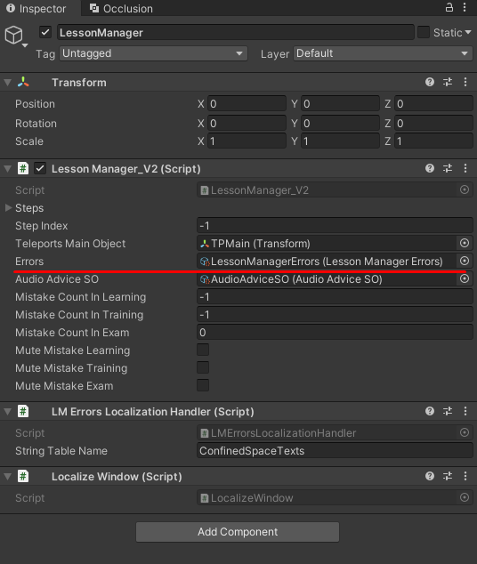  
- Создать ассет AudioAdviceSO ([См. Приложение 3](#приложение-3-работа-с-ассетом-audioadviceso))  
- Прилинковать созданный ассет к LessonManager  

## 2 Настройка ошибок в LM  

Раскрыть

- Открыть LM (Window-LessonManager_V2)  
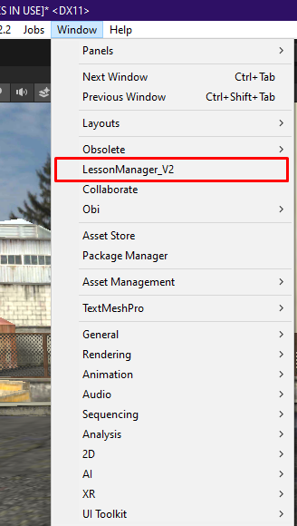  
- Выбрать режим из выпадающего списка  
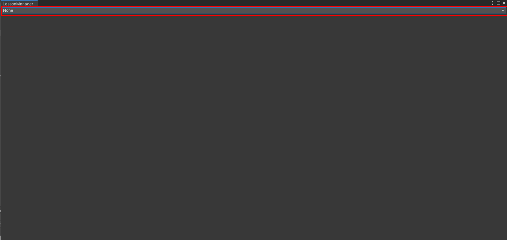  
- Открыть шаг, который необходимо настроить, нажав на кнопку с ID шага  
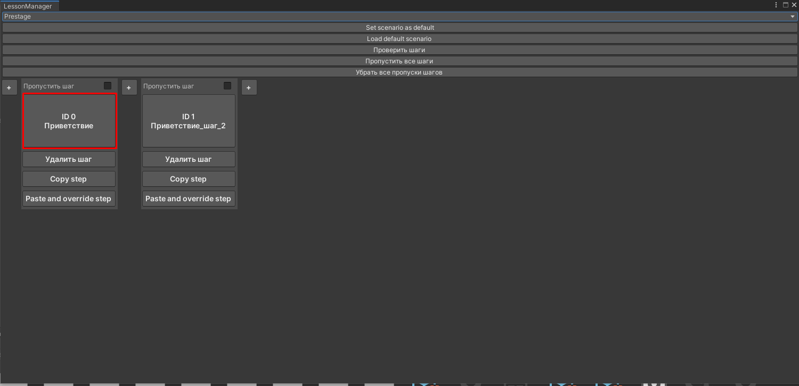  
- Раскрыть блок "Список ивентов, являющихся ошибкой"  
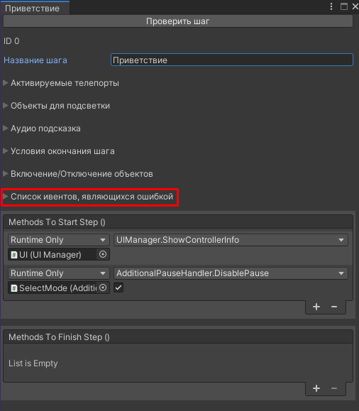  

### 2.1 Добавление ошибки в шаг  

- Нажать кнопку “+”  
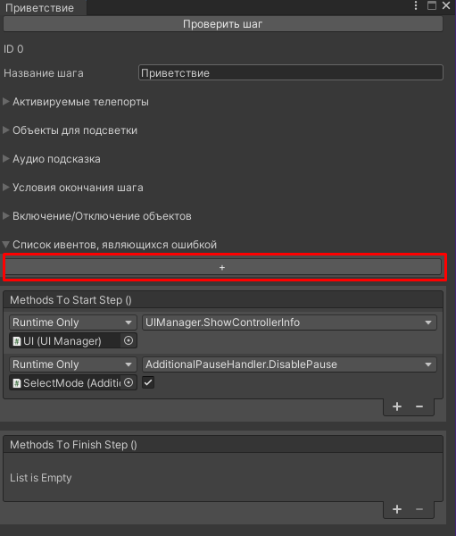  
- Из выпадающего списка необходимо выбрать имя ивента, который считается ошибкой, настроенный в ассете LessonManagerErrors  
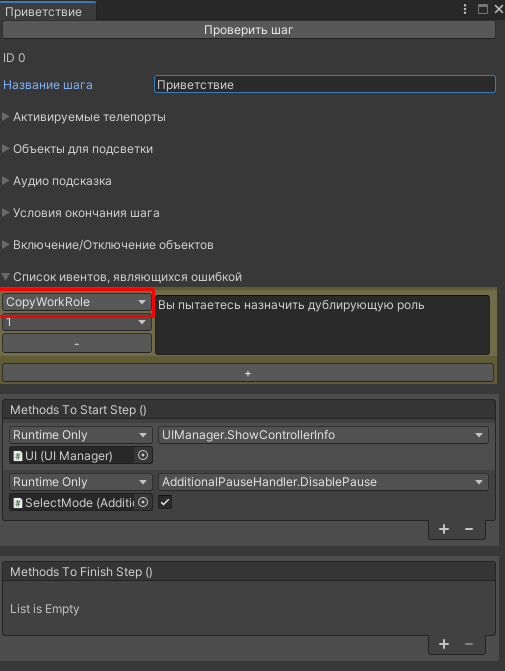  
- Из выпадающего списка необходимо выбрать имя описания ошибки, настроенного в ассете LessonManagerErrors  
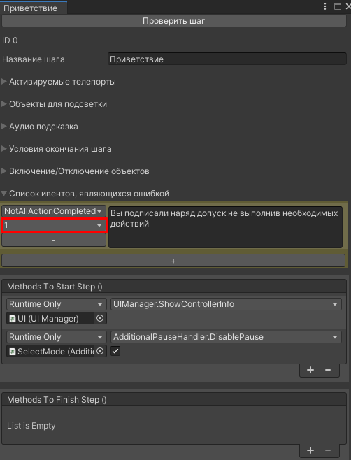  

### 2.2 Удаление ошибки из шага  

- Нажать на кнопку “-” под именем ивента  
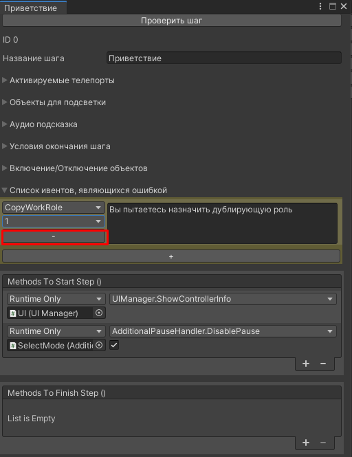  
  
Если текста ошибки нет ни в одном значении выпадающего списка, доступного из LM, то необходимо добавить его в ассет LessonManagerErrors ([См. Приложение 1](#приложение-1-работа-с-ассетом-lessonmanagererrors))  

## 3. Настройка аудиоподсказок в LM  

Раскрыть

- Открыть LM (Window-LessonManager_V2)  
  
- Выбрать режим из выпадающего списка  
  
- Открыть шаг, который необходимо настроить, нажав на кнопку с ID шага  
  
- Раскрыть блок "Аудио подсказка"  
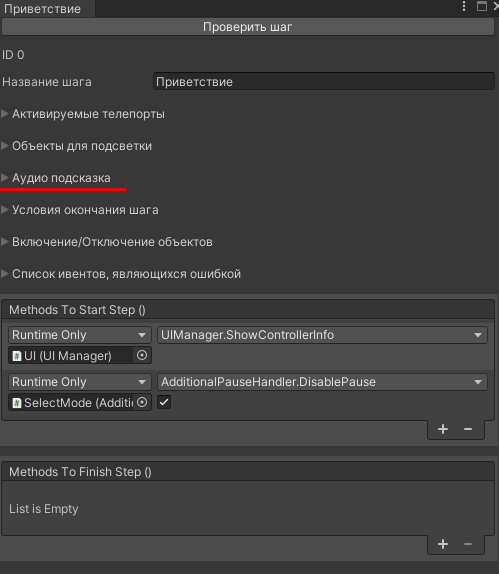  

### 3.1 Добавление аудиоподсказки в шаг  
  
- Из выпадающего списка необходимо выбрать имя аудиоподсказки  
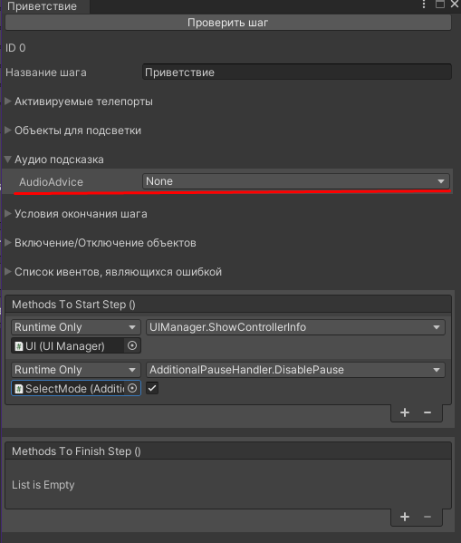  
- В поле "Задержка" вписать значение - количество секунд между началом шага и запуском проигрывания аудиоподсказки  
  
- В поле "Время повтора" вписать значение - количество секунд через которое аудиоподсказка будет повторно запускаться после ее окончания. Чтобы отключить повтор аудиоподсказки значение этого поля следует оставить 0  
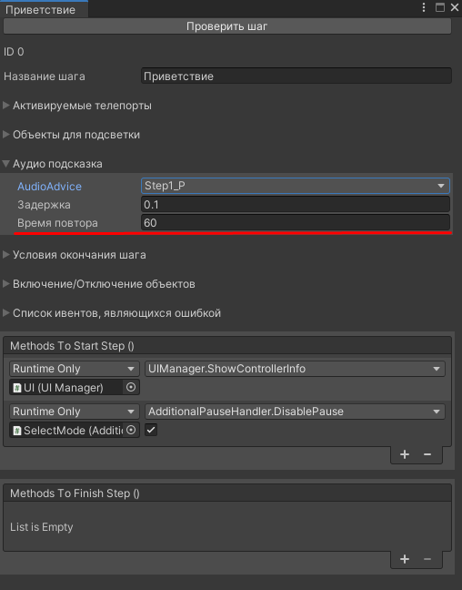  

### 3.2 Удаление аудиоподсказки из шага  

- Для удаления аудиоподсказки из шага достаточно в выпадающем списке выбрать значение "None"  
  
  
Если аудиоподсказки нет ни в одном значении выпадающего списка, доступного из LM, то необходимо добавить его в ассет AudioAdviceSO ([См. Приложение 3](#приложение-3-работа-с-ассетом-audioadviceso))  

## 4. Локализация текстов, не управляемых LM  

Раскрыть

- Добавить локализуемый текст в таблицу локализации ([См. Приложение 2](#приложение-2-работа-с-таблицей-локализации-текстов))  
- На объект TextMeshPro, который необходимо локализовать, добавить компонент "LocalizeStringEvent"  
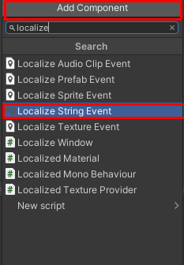  
- В поле "StringReference" выпадающего списка таблицу и ключ локализации  
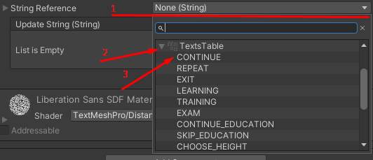  
- Добавить ивент в UpdateString  
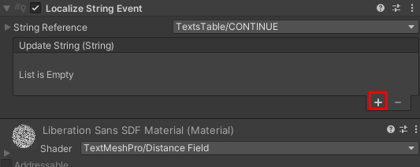  
- В качестве целевого объекта выбрать сам объект  
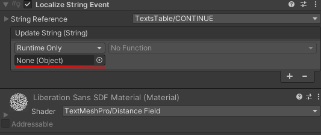  
- В качестве метода выбрать TextMeshPro->Text в блоке "Dynamic string"  
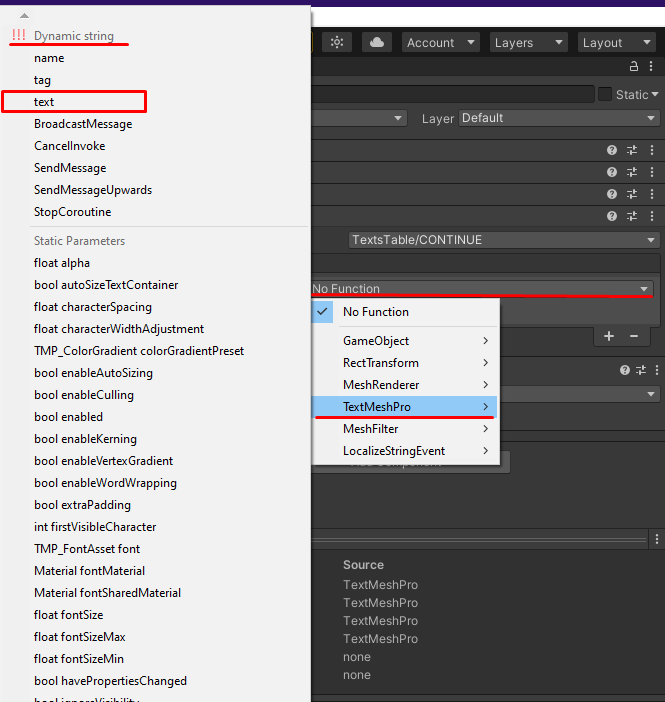  

## 5. Локализация аудио, не управляемого LM  

Раскрыть

- Добавить локализуемый аудиоклип в таблицу локализации ([См. Приложение 4](#приложение-4-работа-с-таблицей-локализации-ассетов))  
- На объект AudioSource, который необходимо локализовать, добавить компонент "LocalizeAudioClipEvent"  
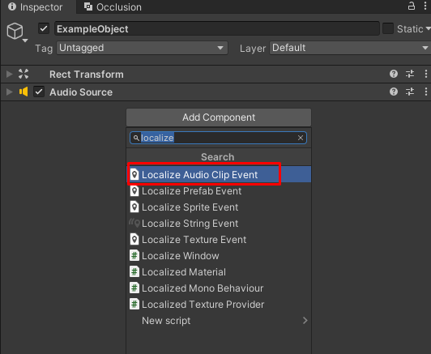  
- В поле "LocalizedAssetReference" выпадающего списка таблицу и ключ локализации  
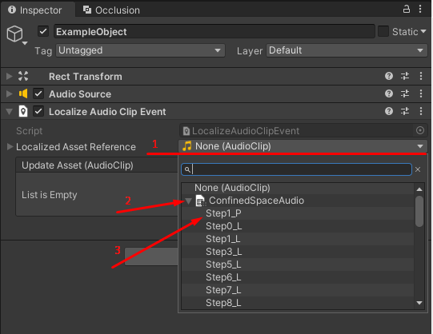  
- Добавить ивент в UpdateAsset  
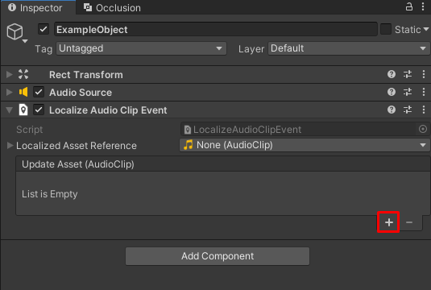  
- В качестве целевого объекта выбрать сам объект  
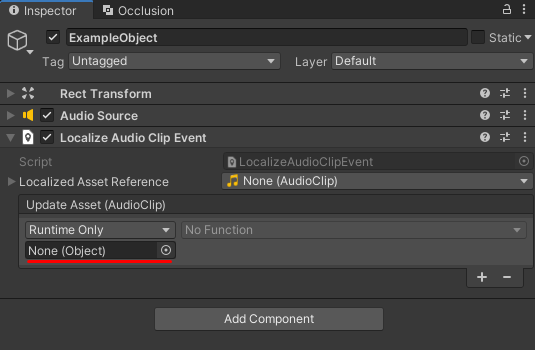  
- В качестве метода выбрать AudioSource->Clip в блоке "Dynamic string"  
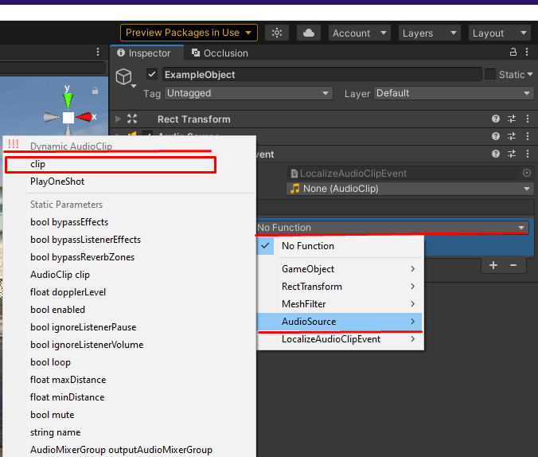  

## 6. Локализация текстур  

Раскрыть

## Приложение 1 (Работа с ассетом LessonManagerErrors)  

Раскрыть

### П.1.1 Создание ассета  

- Создать ассет LessonManagerErrors (ПКМ->Create->LessonManagerErrors)  
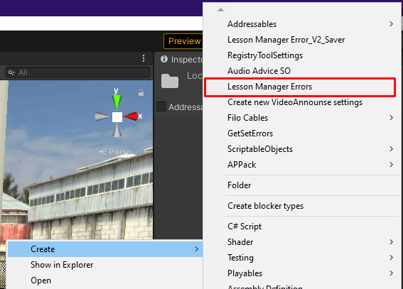  
- В инспекторе включить Debug-режим (троеточие в правом верхнем углу инспектора -> Debug)  
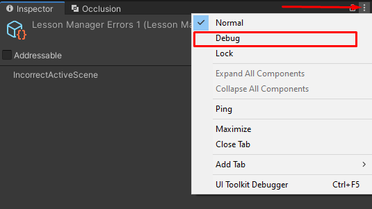  
- В поле SceneName ввести название сцены тренажера для которого проводятся действия  
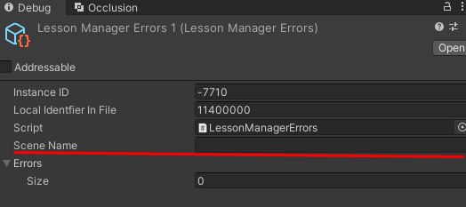  
- В инспекторе включить нормальный режим (троеточие в правом верхнем углу инспектора -> Normal)  
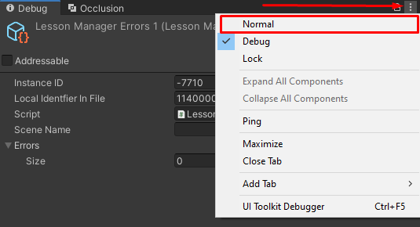  

### П.1.2 Добавление отслеживаемого ивента  

- Нажать кнопку "Add error"  
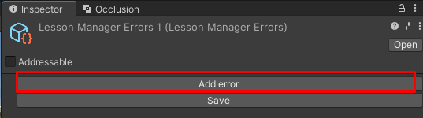  
- Раскрыть созданное поле  
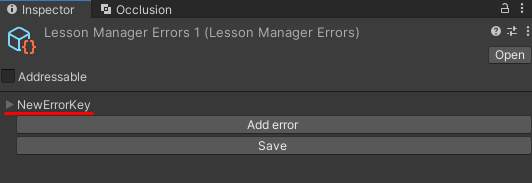  
- Ввести в поле ErrorKey имя ключа для этого ивента  
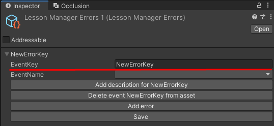  
- Из выпадающего списка EventName выбрать ивент, который считается ошибкой  
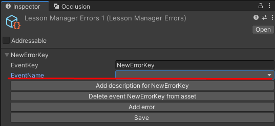  

### П.1.3 Добавление описания ошибки  

- Нажать кнопку "Add description for \[EventKey\]"  
![Кнопка "Add description for \[EventKey\]"](../Images/HowToWorkWithLocalizedLM18.png)  
- Раскрыть созданное поле  
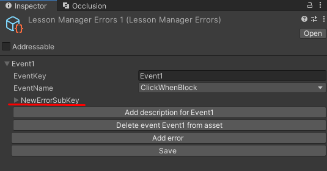  
- В поле DescriptionKey ввести имя описания  
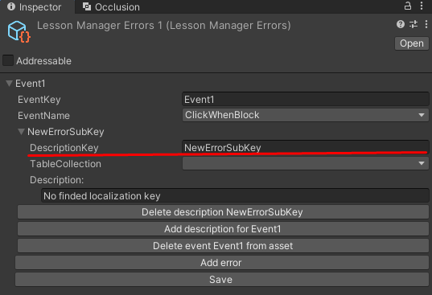  
- Из выпадающего списка TableCollection выбрать коллекцию таблиц, откуда брать локализацию  
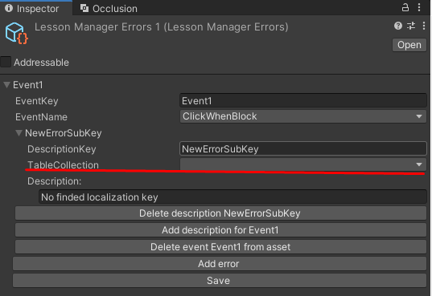  
- Из выпадающего списка LocalizationKeys выбрать ключ локализации  
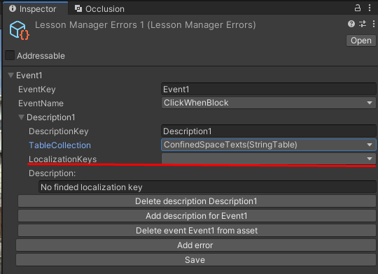  
- Нажать кнопку Save  
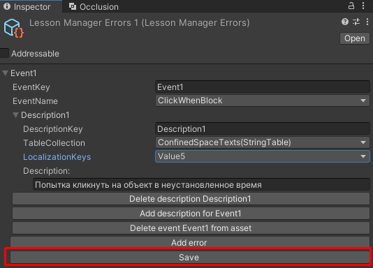  

### П.1.4 Удаление ошибки  

- Если удаляемое описание единственное для ивента, то достаточно нажать на кнопку Delete event \[EventKey\] from asset  
![Кнопка "Delete event \[EventKey\] from asset"](../Images/HowToWorkWithLocalizedLM24.png)  
- Если у ивента, с которым связано описание оно не одно, то необходимо нажать кнопку Delete description \[DescriptionKey\]  
![Кнопка "Delete description \[DescriptionKey\]"](../Images/HowToWorkWithLocalizedLM25.png)  

В случае, если описание ошибки не присутствует ни в каком ключе локализации его необходимо добавить в таблицу локализации ([См. Приложение 2](#приложение-2-работа-с-таблицей-локализации-текстов))  

## Приложение 2 (Работа с таблицей локализации текстов)  

Раскрыть

**Важно! Для каждого типа данных и для каждого тренажера создается отдельная таблица**  

### П.2.1 Создание теблицы локализации  

- Создать папку по пути Assets/Localization использовав в качестве названия название тренажера (Если папка существует, данный пункт пропустить)  
- Открыть окно редактирования таблиц локализации (Window->AssetManagment->LocalizationTables)  
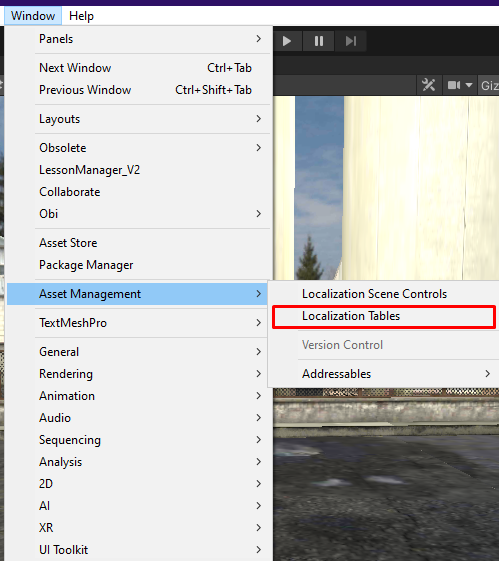  
- В открывшемся окне выбрать вкладку NewTableCollection  
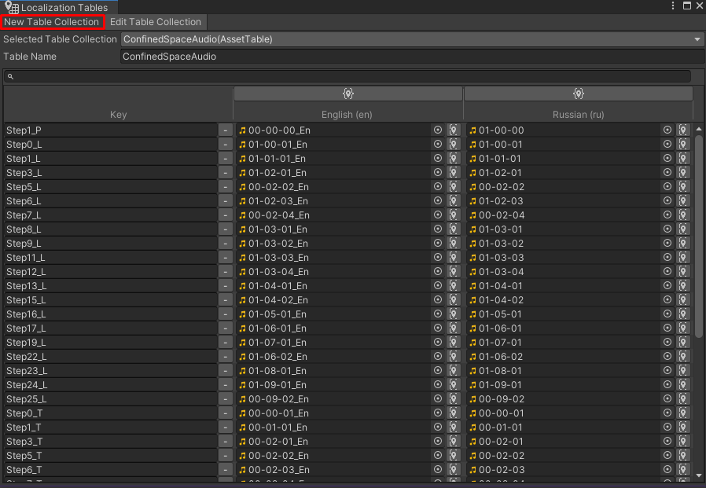  
- В поле Type выбрать из выпадающего списка тип StringTableCollection  
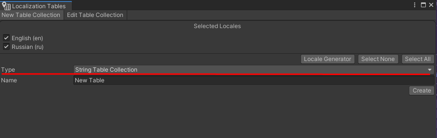  
- В поле Name ввести название таблицы (\[Имя тренажера\]Texts)  
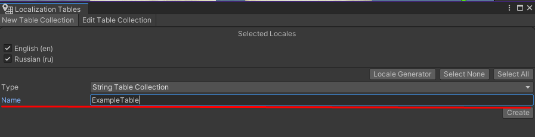  
- Нажать кнопку "Create"  
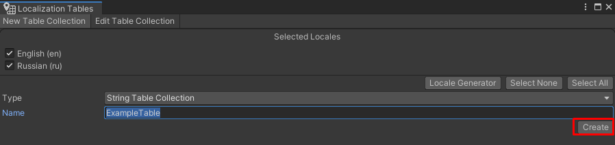  
- В диалоговом окне указать путь к созданной ранее папке  

### П.2.2 Добавление значения в таблицу локализации  

- Из выпадающего списка выбрать редактируемую таблицу локализации  
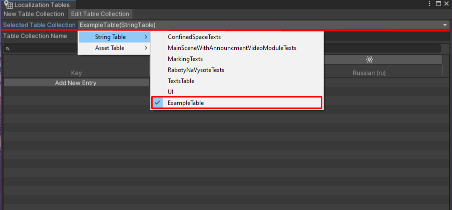  
- Нажать кнопку "AddNewEntry"  
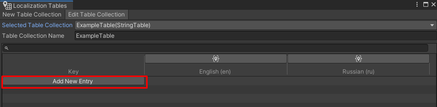  
- В ячейку на пересечении столбца "Key" и созданной строки ввести имя ключа добавляемого в таблицу  
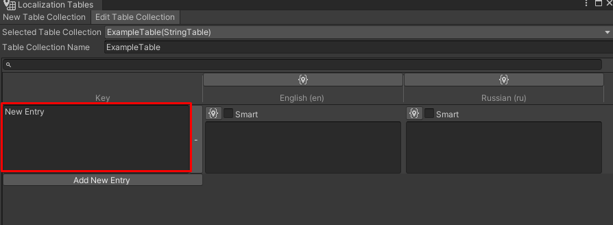  
- В ячейку на пересечении столбца "\[Имя языка на английском языке\]" и созданной строки ввести текстовое значение на данном языке  
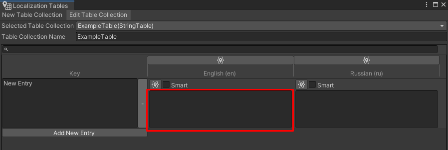  
### П.2.3 Удаление значения из таблицы локализации  

- Нажать кнопку "-" справа от имени ключа  
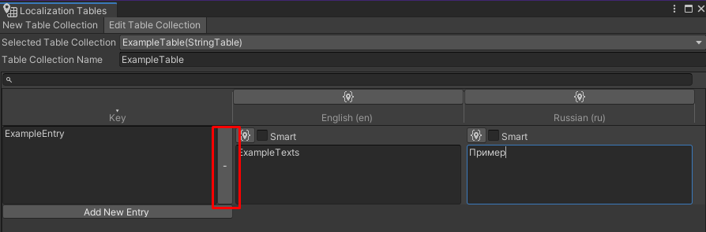  

### П.2.3 Синхронизация таблицы локализации текста с гугл таблицами  

Раскрыть

#### П.2.3.1 Создание и настройка подключения к гугл таблицам  

- Создать ассет GoogleSheetsProvider (ПКМ->Create->Localization->GooogleSheetProvider)  
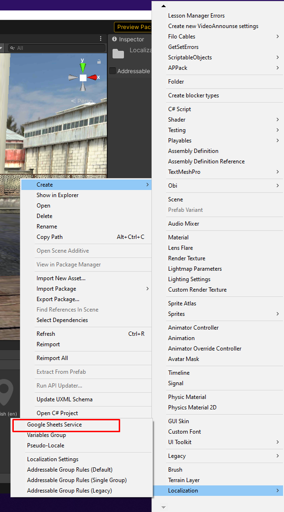  
- в поле ApplicationName вписать имя приложения в гугл-сурвисах (vr-trainers-localization)  
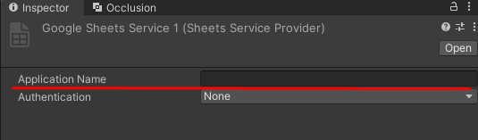  
- Из выпадающего списка выбрать тип аутентификации OAuth  
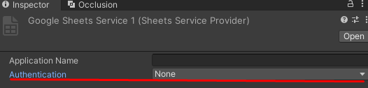  
- в поле ClientID вписать ID, выданный ответственным за приложение для синхронизации с гугл таблицами  
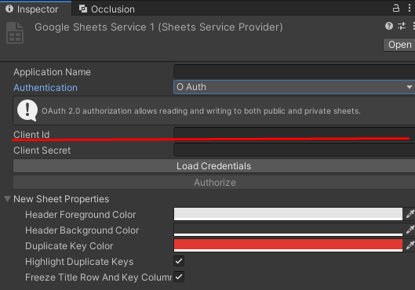  
- В поле ClientSecret вписать пароль, выданный ответственным за приложение для синхронизации с гугл таблицами  
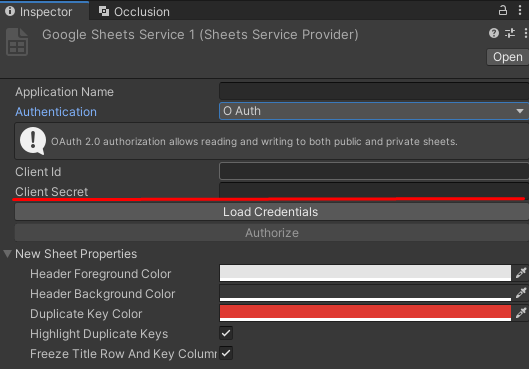  
- Нажать кнопку Authorize  
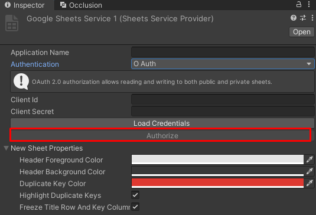  
- В открывшемся окне браузера выбрать гугл аккаунт, который будет использоваться для работы с гугл таблицами  
- Резальтатом таких действий должно стать сообщение в консоли "Authorized \[Дата\] \[Время\]"  
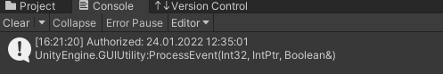  

#### П.2.3.2 Настройка таблицы для последующей синхронизации с гугл таблицами  

- Выбрать ассет коллекции таблиц (Пример иконки ниже)  
  
- В блоке Extenshions нажать кнопку "+"  
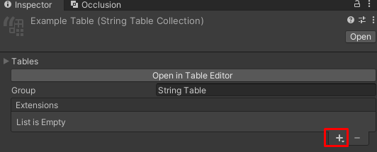  
- Выбрать GoogleSheetExtenshions  
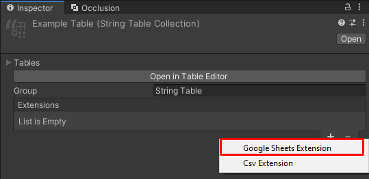  
- В поле SheetsServiceProvider выбрать ассет провайдера гугл таблиц  
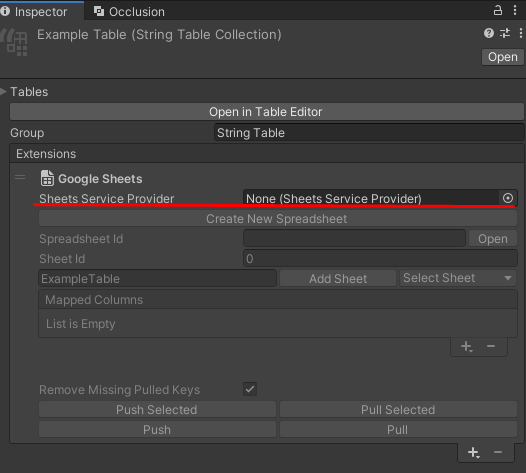  
- В поле SpreadSheetID ввести ID гугл таблицы  
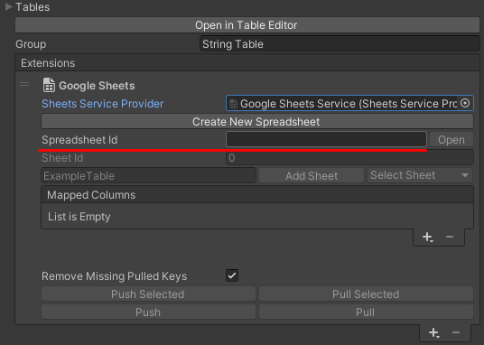  
- Под полем SheetID ввести имя таблицы  
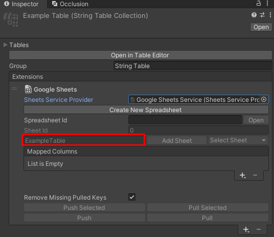  
- Нажать кнопку AddSheet  
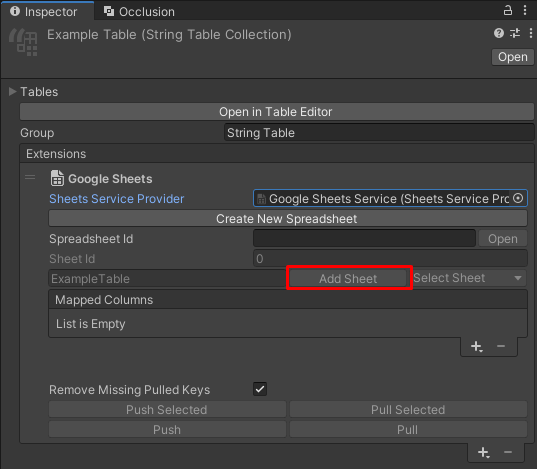  
- Из выпадающего списка выбрать созданный лист  
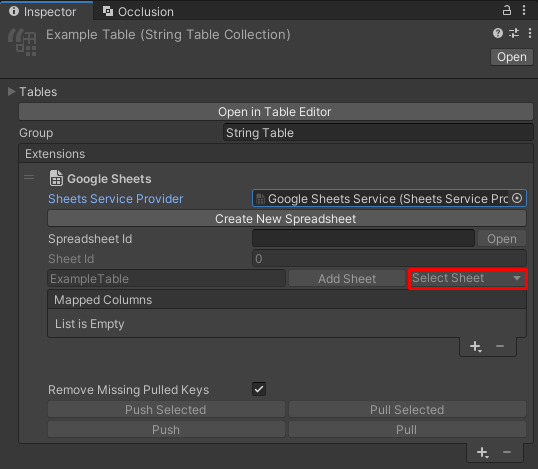  
- В блоке MapppedColumns нажать кнопку "+"  
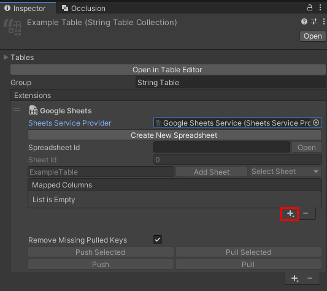  
- Из выпадающего списка выбрать KeyColumn  
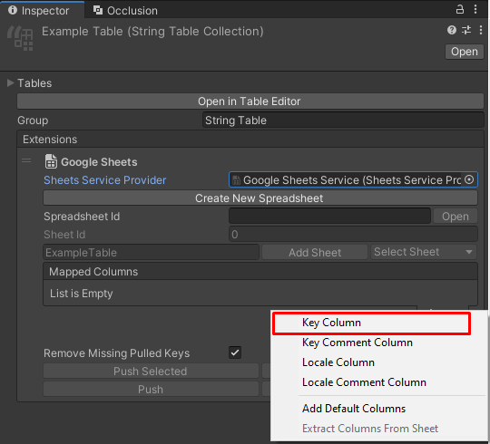  
- В блоке MapppedColumns нажать кнопку "+"  
  
- Из выпадающего списка выбрать LocaleColumn  
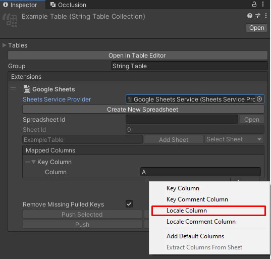  
- В поле LocaleIdentifier выбрать английскую локаль  
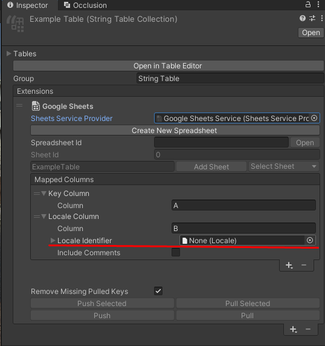  
- В блоке MapppedColumns нажать кнопку "+"  
  
- Из выпадающего списка выбрать LocaleColumn  
  
- В поле LocaleIdentifier выбрать русскую локаль  
  

#### П.2.3.3 Синхронизация серверной таблицы с таблицей в проекте  

- Выбрать ассет коллекции таблиц (Пример иконки ниже)  
  
- Нажать кнопку Push  
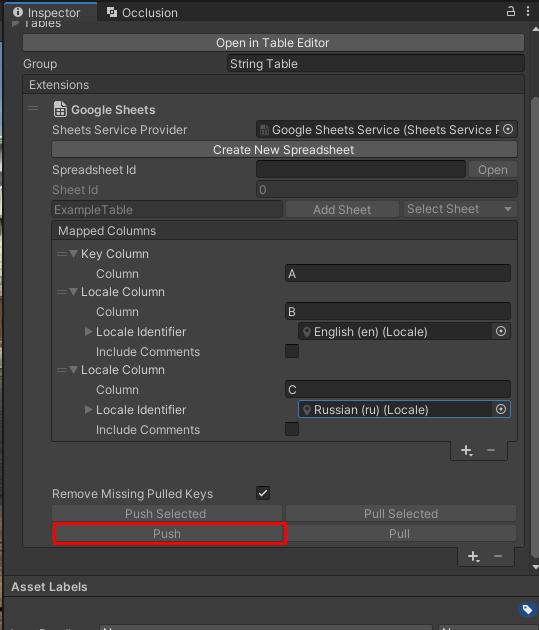  

#### П.2.3.4 Синхронизация таблицы в проекте с серверной таблицей  

- Выбрать ассет коллекции таблиц (Пример иконки ниже)  
  
- Нажать кнопку Pull  
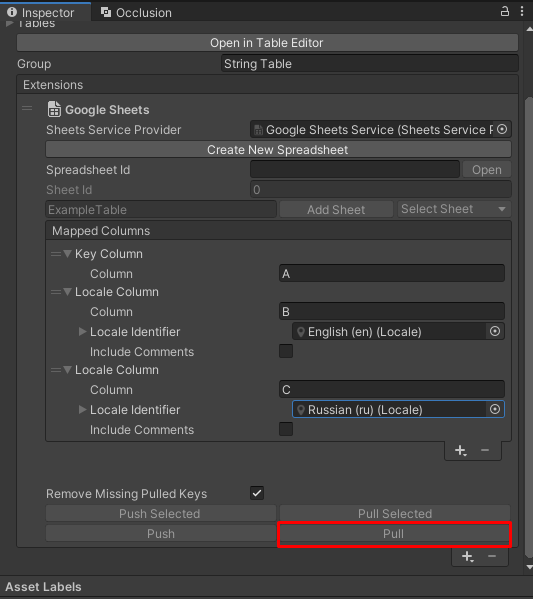  

## Приложение 3 (Работа с ассетом AudioAdviceSO)  

Раскрыть

### П.3.1 Создание ассета  

- Создать ассет (ПКМ->Create->AudioAdviceSO)  
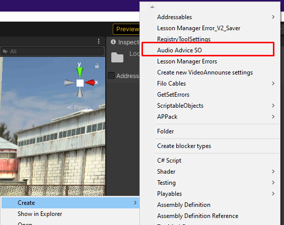  

### П.3.2 Добавление аудиоподсказки в ассет  

- Раскрыть блок с именем режима, в который надо добавить аудиоподсказку  
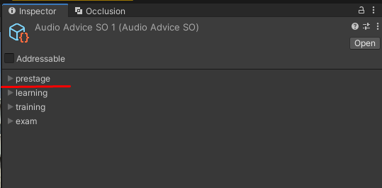  
- Нажать кнопку "AddAudioAdvice for \[Имя режима\]"  
![Кнопка "AddAudioAdvice for \[Имя режима\]"](../Images/HowToWorkWithLocalizedLM65.png)  
- Раскрыть созданный элемент  
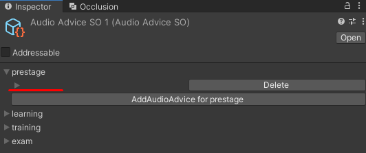  
- В поле "ElementKey" ввести идентификатор аудиоподсказки по следующему формату: Step\[Номер шага\]_\[Первая буква названия режима\]  
  
- В поле "LocalizedAsset" из выпадающего списка выбрать таблицу локализации и ключ локализации, который необходимо связать с данным элементом  
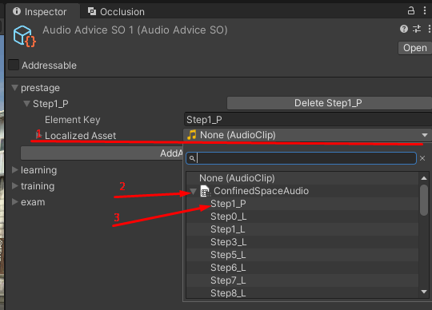  

### П.3.3 Удаление аудиоподсказки из ассета  

- Раскрыть блок с именем режима, из которого надо удалить аудиоподсказку  
  
- Нажать кнопку "Delete \[ElementKey\]"  
![Кнопка "Delete \[ElementKey\]"](../Images/HowToWorkWithLocalizedLM69.png)  

В случае, если описание ошибки не присутствует ни в каком ключе локализации его необходимо добавить в таблицу локализации ([См. Приложение 4](#приложение-4-работа-с-таблицей-локализации-ассетов))  

## Приложение 4 (Работа с таблицей локализации ассетов)  

Раскрыть

**Важно! Для каждого типа данных и для каждого тренажера создается отдельная таблица**  

### П.4.1 Создание теблицы локализации  

- Создать папку по пути Assets/Localization использовав в качестве названия название тренажера (Если папка существует, данный пункт пропустить)  
- Открыть окно редактирования таблиц локализации (Window->AssetManagment->LocalizationTables)  
  
- В открывшемся окне выбрать вкладку NewTableCollection  
  
- В поле Type выбрать из выпадающего списка тип AssetTableCollection  
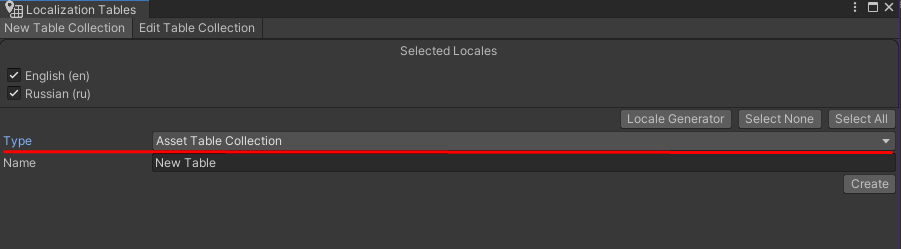  
- В поле Name ввести название таблицы (\[Имя тренажера\]Texts)  
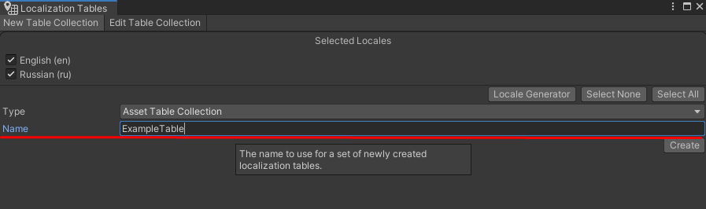  
- Нажать кнопку "Create"  
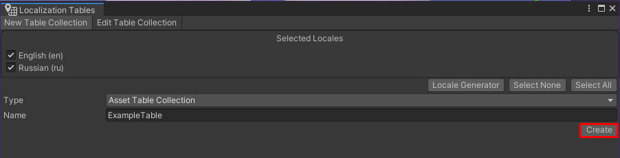  
- В диалоговом окне указать путь к созданной ранее папке  

### П.4.2 Добавление значения в таблицу локализации  

- Из выпадающего списка выбрать редактируемую таблицу локализации  
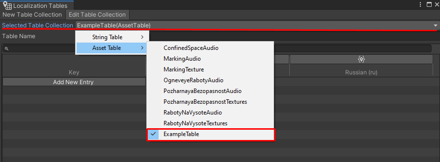  
- Нажать кнопку "AddNewEntry"  
  
- В ячейку на пересечении столбца "Key" и созданной строки ввести имя ключа добавляемого в таблицу  
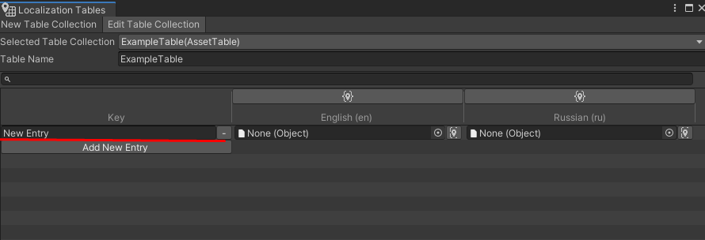  
- В ячейку на пересечении столбца "\[Имя языка на английском языке\]" и созданной строки прилинковать локализованный ассет на языке столбца  
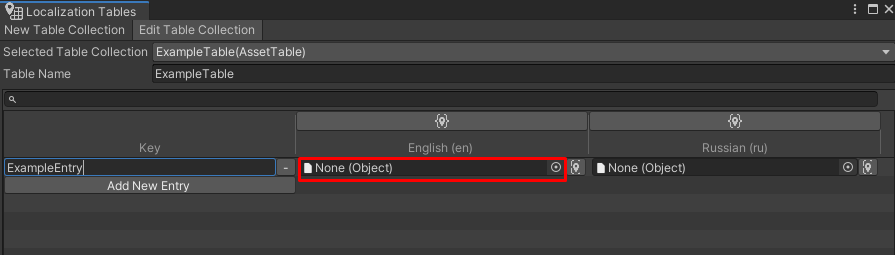  

### П.4.3 Удаление значения из таблицы локализации  

- Нажать кнопку "-" справа от имени ключа  
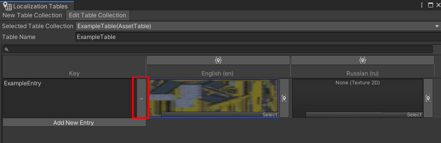  

