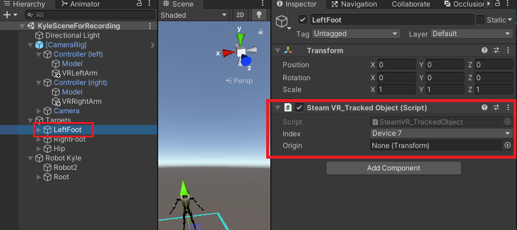
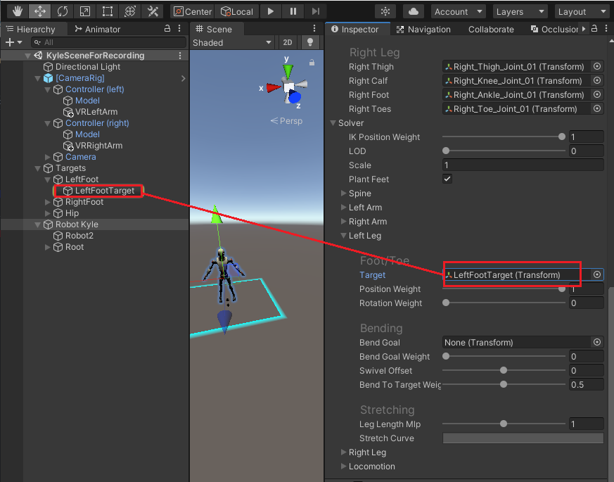
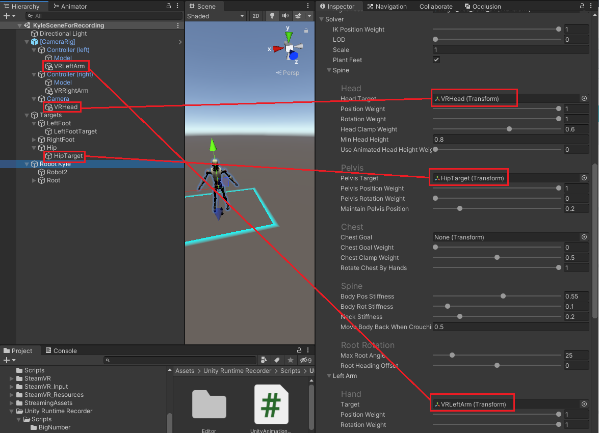
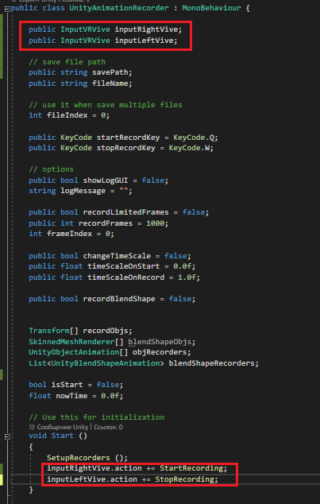

# Настройка проекта для записи анимации с HTC Vive Pro

- открываем новый проект, добавляем на сцену гуманоидного персонажа для записи анимаций
- добавляем ассет из PackageManager "SteamVRPlugin" добавляем из него префаб CameraRig на сцену
- добавляем ассет из UnityStore "Final IK" из него добавляем скрипт VRIK на нашего гуманоидного персонажа
- создаем объект пустышку Targets с центром в координатах 0,0,0 как и наш персонаж
- чайдлами к этой пустышке добавляем еще три (по количеству дополнительных контроллеров) пустышки объекта LeftFoot, RightFoot, Hip
- на эти три новые пустышки добавляем скрипты SteamVR_TrakedObject в index которых устанавливаем номера дополнительных контроллеров в порядке их определения камерами при включении (с 5 по 7 к примеру для 3)



***Они будут следовать за контроллерами***

- в свою очередь под эти пустышки мы добавляем еще чайдлами пустышки ссылки на которые установим в скрипт VRIK 



***Они будут следовать за контроллерами но с определенным офсетом и двигать соответсвующие кости***

- по тому же принципу добавляем пустышки чайдлами и в префаб CameraRig->Controller(left), CameraRig->Controller(right), CameraRig->Camera


и по аналогии назначаем им ссылки в VRIK

- теперь необходимо добавить ассет записи анимации в рантайме Unity-Runtime-Animation-Recorder [ссылка на git](https://github.com/newyellow/Unity-Runtime-Animation-Recorder)
- добавляем возможность записи анимации с помощью скрипта UnityAnimationRecorder на гуманоидного персонажа
- и возможность по клику на джойстики начать и закончить запись анимации добавляем скрипты 

Для этого добавляем скрипты:
```
using System.Collections;
using System.Collections.Generic;
using UnityEngine;
using UnityEngine.Events;
using Valve.VR;

public class InputVRVive : MonoBehaviour
{ 
    public SteamVR_Action_Boolean grabPinch; //Grab Pinch is the trigger, select from inspecter
    public SteamVR_Input_Sources inputSource = SteamVR_Input_Sources.Any;//which controller

    public UnityAction action;
 
    void OnEnable ()
    {
        if (grabPinch != null)
        {
            grabPinch.AddOnChangeListener(OnTriggerPressedOrReleased, inputSource);
        }
    }
 
 
    private void OnDisable()
    {
        if (grabPinch != null)
        {
            grabPinch.RemoveOnChangeListener(OnTriggerPressedOrReleased, inputSource);
        }
    }
 
 
    private void OnTriggerPressedOrReleased(SteamVR_Action_Boolean booleanAction, SteamVR_Input_Sources sources, bool isTriggerPressed)
    {
        if (isTriggerPressed)
        {
            action?.Invoke();
        }
    }
}
```
InputVRVive на CameraRig->Controller (и соответсвующий контроллер)

после добавляем в скрипт UnityAnimationRecorder(+ UnityAnimationRecorderEditor) соответсвующие поля для каждого джойстика и подпись на события которые олицетворяют нажатие на джойстики
Для правого джойстика StartRecording, а для левого джойстика StopRecording




Теперь проект полностью настроен
