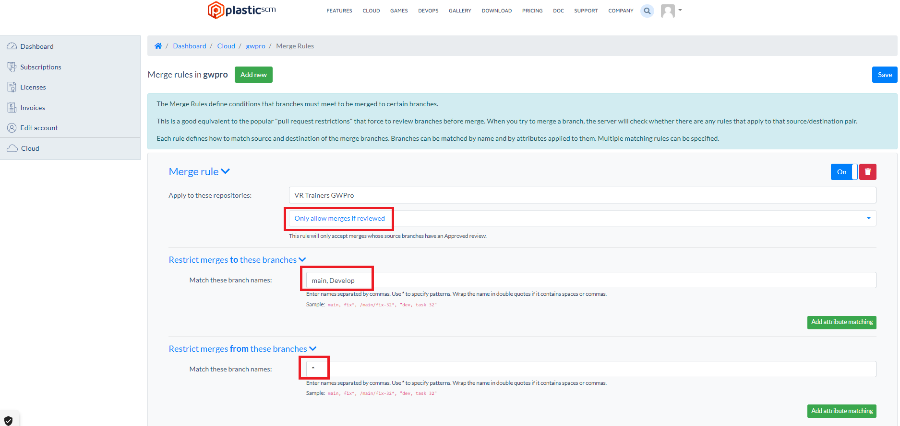
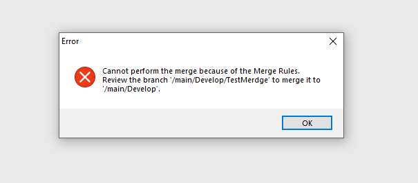
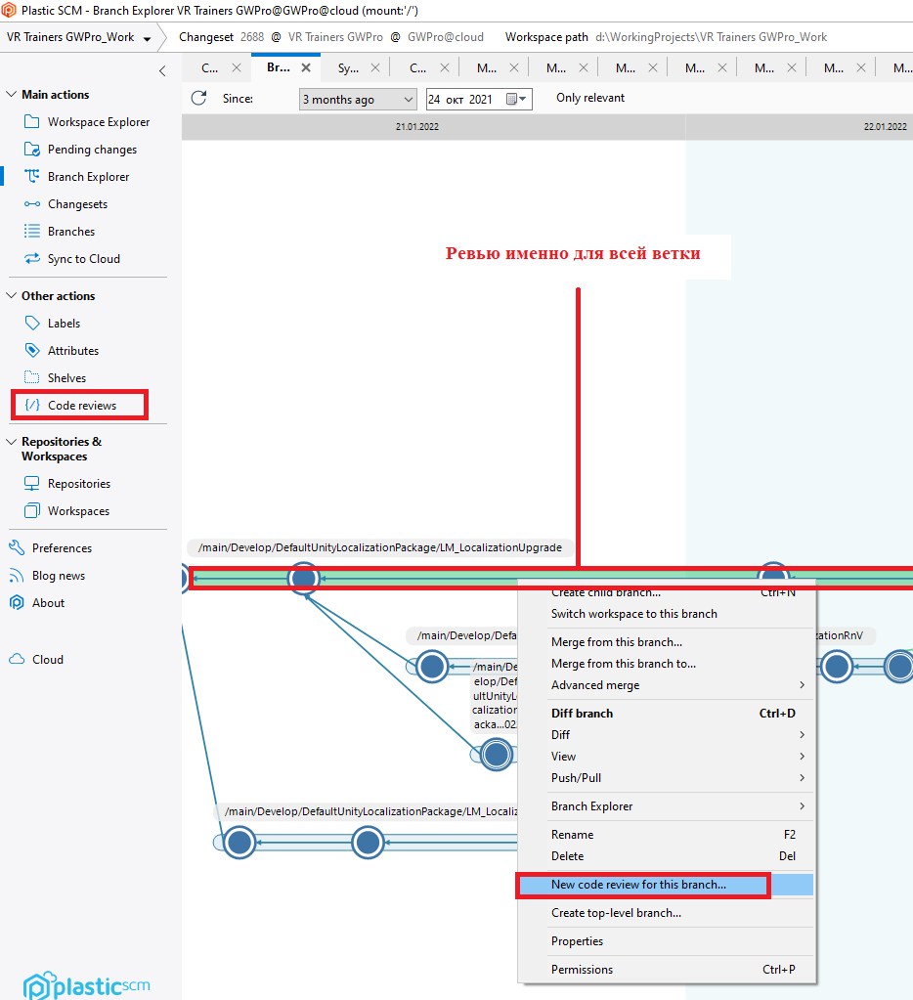
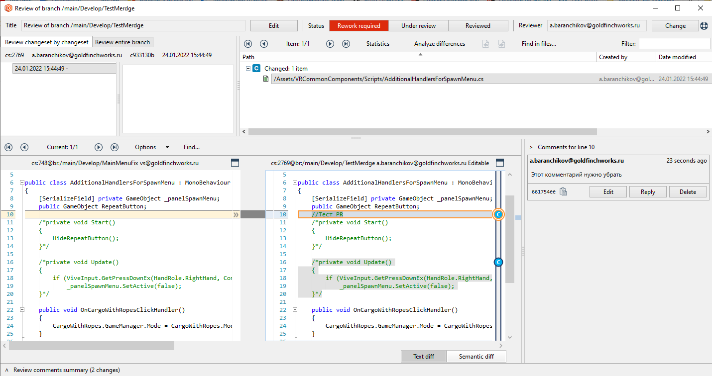
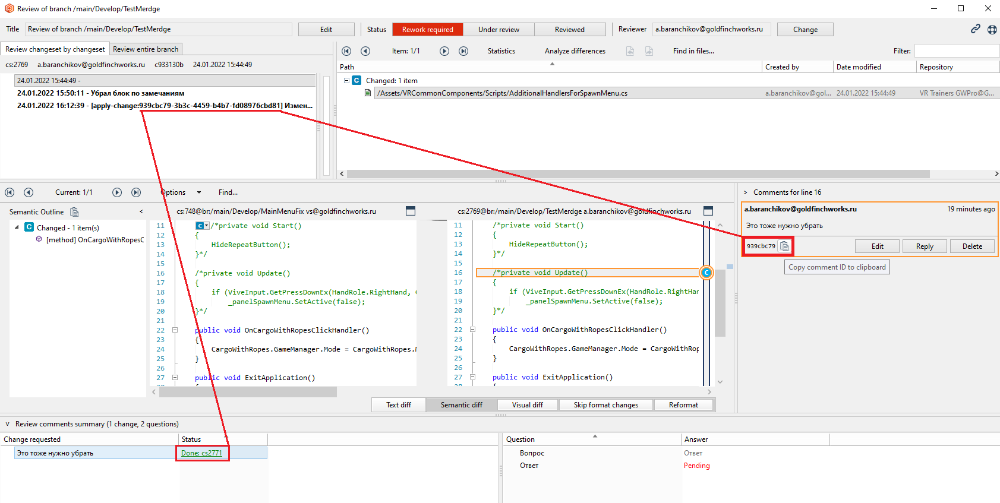
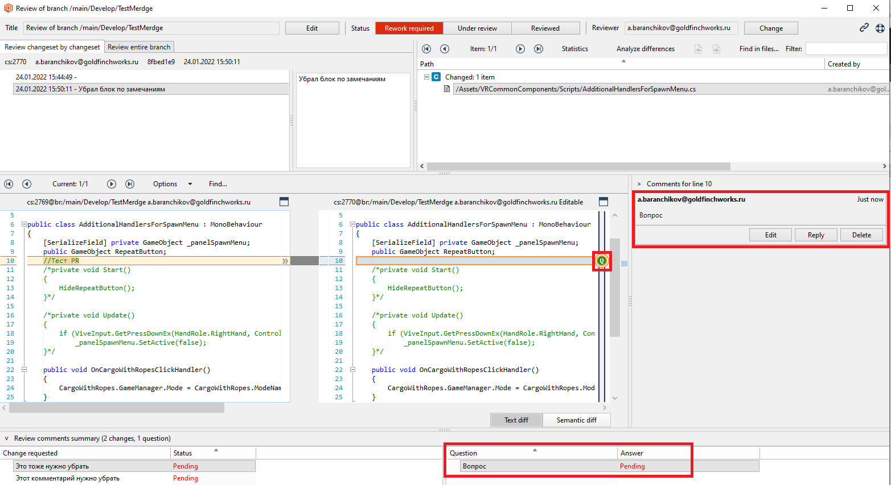
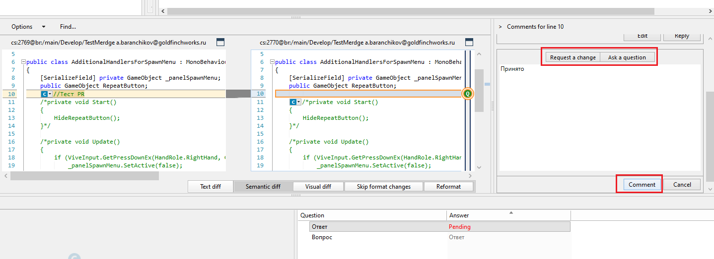
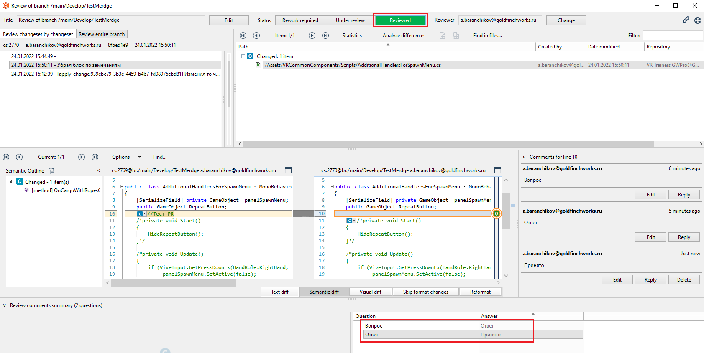

# Как вносить PullRequest в Plastic

[Оффициальная документация о том как вести CodeReviews в Plastic](https://www.plasticscm.com/documentation/gui/plastic-scm-version-control-gui-guide#Chapter21:TheCodeReviewsView)

В нашем репозитории SCM Plastic "VR Trainers GWPro" установлены следующие конфигурации мерджа

в ветки main и Develop запрещено вносить изменения с (со всех дочерних от них) веток которые не прошли ревью.

При попытке слить main и Develop с другими ветками появляется сообщение:

Теперь что бы была возможность слить ветви необходимо вызвать меню ревью для конкретной ветки которую хотим слить и добится того что бы статус ревью был 
"Reviwed" 

Для того чтобы создать меню ревью необходимо выделить ветвь и нажать в контекстном меню пункт "New code review for this branch..."
Далее мы сможем проверять статус и ход самого ревью через навигационное меню слева "CodeReviews" 

# Комментарии для изменения кода

Когда мы открыли меню ревью для этой ветви мы можем писать комментарии на изменение (которые подразумевают что итоговым ответом на этот комментарий будет изменение в коде и следющий коммит)

В меню добавления вопроса нужно выбрать пункт "Request a change"

После того как человек которого попросили изменить код внес необходимые правки он должен создать коммит в названии которого обязательно должна присутствовать следующая строка

- [apply-change:а здесь определенный ID комментария] далее пишешь что хочешь

После этого, статус комментария изменится с Pending в Done.

Далее можно провести, либо еще одну итерацию ревью, либо отметить что ревью пройденно 

(если попытаться отметить что ревью пройденно а коментарии будут в статтусе Pending то появится контекстное окно предупреждающее об этом)

# Комментарии вопрос/ответ

Помимо комментария на изменение, можно написать комментарий в формате вопрос/ответ (для разговоров на тему почему так, а не иначе)

В меню добавления вопроса нужно выбрать пункт "Ask a question"

После того как дискусия окончена что бы статус с Pending изменился на пустой необходимо оставить комментарий без папрметра

Далее можно провести, либо еще одну итерацию ревью, либо отметить что ревью пройденно 

(если попытаться отметить что ревью пройденно а коментарии будут в статтусе Pending то появится контекстное окно предупреждающее об этом)

