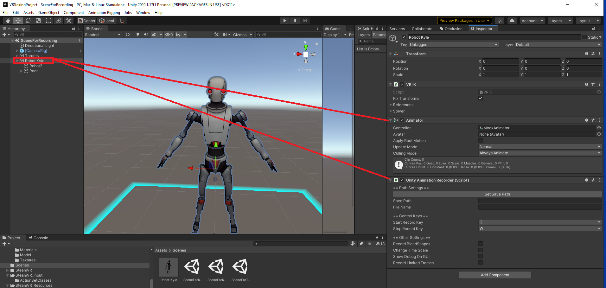
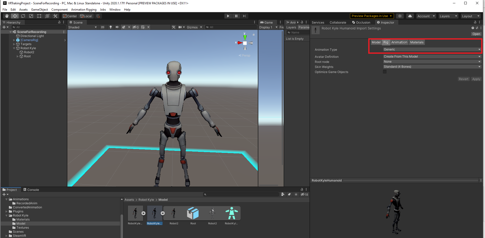
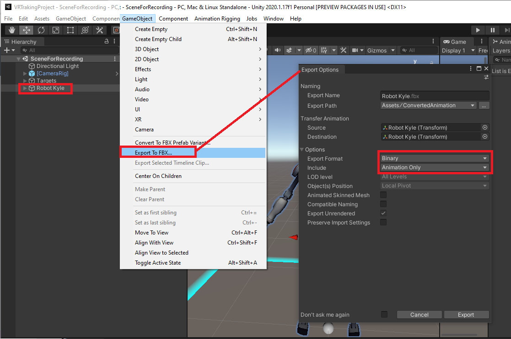
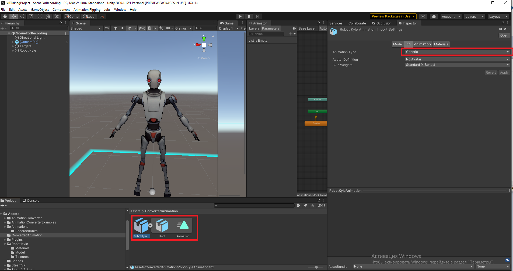
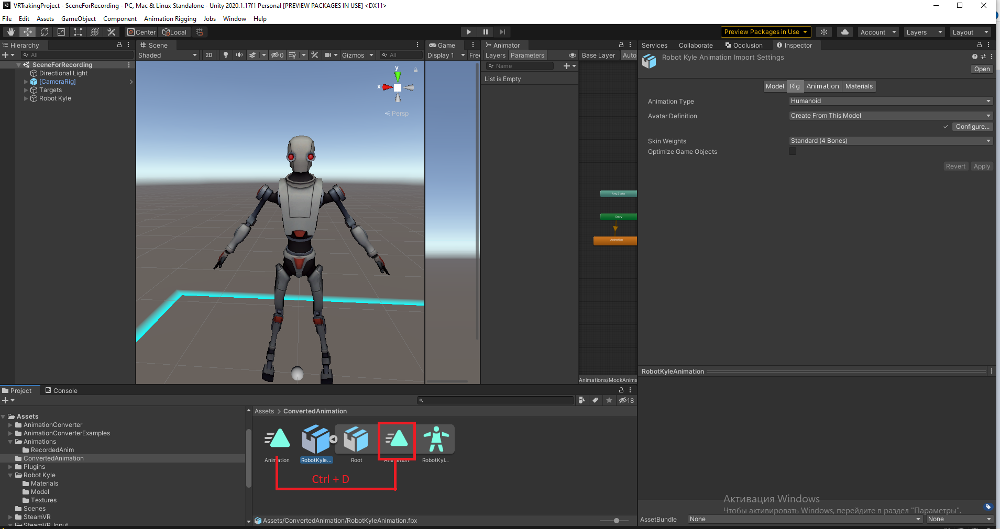
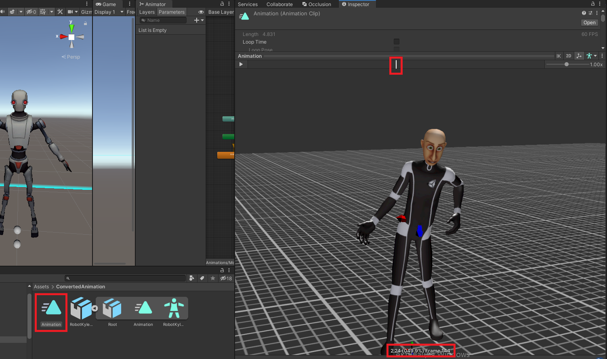
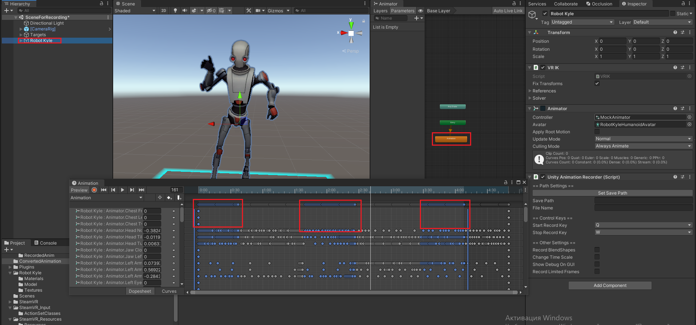
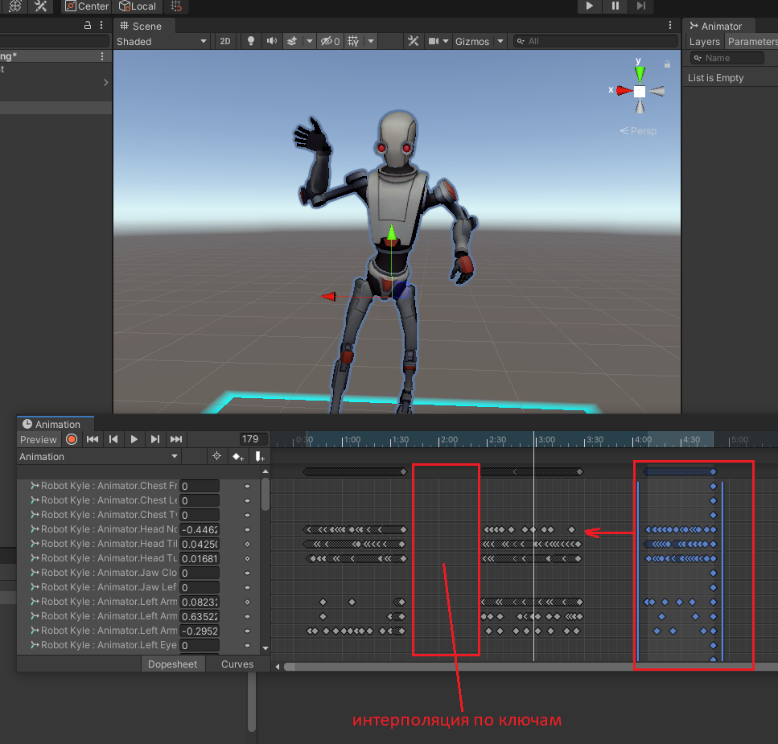

# Порядок действий для записи клипа анимации в FBX c типом Humanoid

Необходимые ассеты 

- UnityRuntimeAnimationRecorder [ссылка на Git](https://github.com/newyellow/Unity-Runtime-Animation-Recorder)
- FBX Exporter [ссылка на офф документацию](https://docs.unity3d.com/Packages/com.unity.formats.fbx@4.1/manual/index.html)

1. Записываем анимации с аниматором и Unity Recorder в корне Humanoid персонажа

***но в настройках он должен стоять как Generic***

2. C помощью Ассета FBXExporter экспортируем анимацию с модели в формате fbx, на объекте со сцены который экспортируем обязательно должен быть аниматор с нашей необходимой анимацией

Получив анимацию изменяем AnimationType с Generic на Humanoid

Внутри появляется аватар откуда была записана Humanoid анимация теперь мы сам анимационный клип можем переносить на персонажей с типом Humanoid из файла FBX
либо если нам необходимо изменение ключей в анимационном клипе то можем вынести этот клип из под fbx (Ctrl+D или Ctrl+C, Ctrl+V)

# Обрезка анимации

Для того чтобы убрать лишние движения из анимации необходимо обязательно извлечь клип из fbx файла что бы иметь возможность его редактировать

Просмотрев анимационный клип в окне превью с дефолным персонажем из Unity мы можем с помощью ползунка определить на каких минутах находятся необходимые нам анимации а на каких минутах мусорные которые нужно удалить.

После выяснения таймкодов мы открываем сам клип анимации, не растягивая его продолжительность (т.к. если мы его растянем то потеряем именно те тайм коды которые определили для себя до растяжки),
выделяем и удаляем те ключи анимации которые нам к примеру, не нужны. 

Для удобства можно закинуть анимационный клип на аниматор персонажа и выделив самого персонажа можно смотреть как выглядят ключи клипа в поределенное время на костях персонажа
для выделения пачек ключей можно использовать Ctrl + выделение (зажатие ЛКМ) для масштабирования таймлайна клипа колесико мыши

После удаления ненужных ключей между нужными образуются разрывы которые интерполируются между собой додумывая все ключи между, 
что бы этого избежать, необходимо сдвинуть пачки анимационных ключей к нужным, или оставить некоторые разрывы уменьшив по необходимости их размеры.

