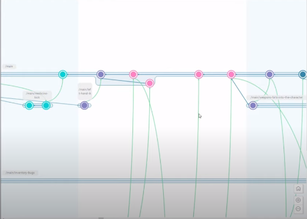

Принцип работы файла "Ignore" отличается от привычной системы git. Файлы и папки для игнорирования, которые были внесены в него после запуска проекта, приводят к затруднениям в работе т.к. не игнорируются в полной мере. Перед заливкой проекта в репозиторий необходимо убедиться в наличии и правильной настройке "Ignore" файла.

# Основы работы с Plastic SCM  
  
Из этого видео вы узнаете, чем Plastic SCM отличается от Git, как начать работать с Plastic, как правильно делать merge веток, научитесь настраивать клиент для удобной работы и узнаете каким стратегиям придерживаться при работе с данной системой контроля версий.  
  
**ССЫЛКА НА ВИДЕО :arrow_up::arrow_up::arrow_up:**

[Официальная инструкция по работе с Plastic]{https://www.plasticscm.com/documentation/labs/main}

[Как выглядит gitignor для Plastic]{http://blog.plasticscm.com/2020/01/definitive-ignoreconf-for-unity-projects.html}

# ПРАВИЛА НАШЕЙ КОМАНДЫ ПО РАБОТЕ В PLASTIC  
**Как работаем в Plastic SCM**  
Plastic - система контроля версий, поддерживающая ветки разработки, которые можно разделять и сливать.  
Есть 3 основные ветки для каждого:
1) Main - главная ветка, там лежат только полностью рабочие версии приложения. В нее коммитит только техлид
2) Develop - основная "current" ветка разработки. Для того, чтобы залить в нее изменения, нужно будет отправить pull request, техлид его одобряет и разрешает, либо говорит, что изменить
3) Личная ветка разработки (или даже несколько, как удобнее). В ней можно делать что угодно
...  

Сцены проекта:
1) Main - основная сцена, у каждого она есть, в нее заливать изменения по согласованию с техлидом (т.е. "Никита, я доделал свои шаги, main сейчас свободна, чтобы я их залил?") и только в develop сцене. Художник и Sound designer могут в ней работать постоянно без лишней синхронизации (но в своих ветках все равно)
2) Своя отдельная сцена. В ней экспериментируем, в основную добавляем только готовые оттестированные решения
