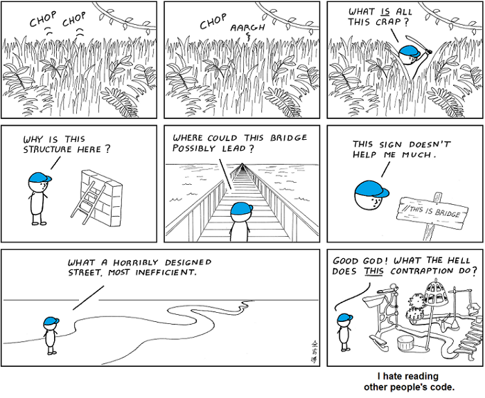
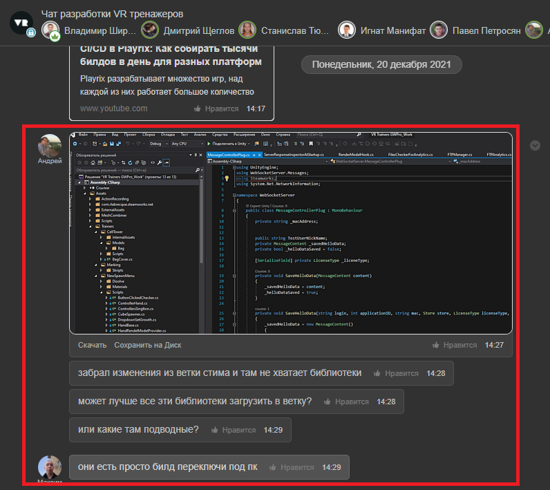
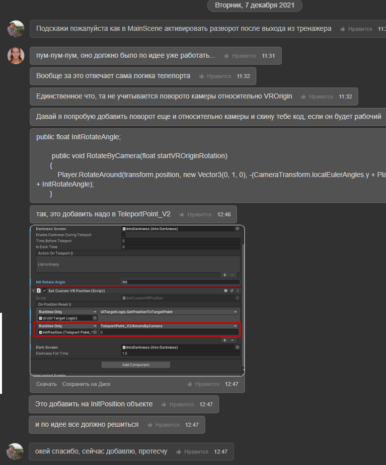

# Работа с чужим кодом 

***Все кроме вас пишут ужасный код***

  

Лвиная доля работы программиста - это работа с кодом напирсанным другими программистами.
При этом неважно то, насколько запутанным выглядит подобный код, или то, как плохо он написан.
«Чужим кодом», кстати, может быть то, что было написано самим программистом, скажем, год назад.

## Как правильно читать чужую работу

В определенный момент нам будет необходимо использовать чужой компонент для своей работы
При чтении чужого компонента мы придерживаемся такого порядка
1. Читаем зависимости (находится они могут в сериализованных полях из инспектора, Start, Awake или пробрасываться через параметры методов к примеру Init()) этого компонента и убеждаемся что они доступны в нашем проекте проинициализированны должным образом и в правильном порядке, установленны Drag and Drop со сцены и.т.д
2. Читаем публичное API компонента (в этом нам помогает наш код стайл, когда все публичные компоненты идут выше приватных)
3. Обращаем внимание на статику которая провоцирует неявную зависимость (где нибудь внутри приватного метода может вызыватся статичный метод или назначатся поле которое мы не учтем из за чего будет непонятно почему компнент ведет себя иначе) Такие статичные зависимости принято выписавыть в комментариях summary класса

## Если API непонятно
Обязательно пишем о недопонимании работы API в общем чате для обсуждения и конкретизации и исправления непонятных нюансов

  
## Если API понятно и поведение ожидаемо
Пользуемся данным компонентом.

## Если API понятно и поведение отличается от ожидаемого 

- если для его корректировки необходимы небольшие изменения в его реализации, то описываем проблему
и те элементы которые хотим изменить в общий чат для обсуждения при одобрении автора и других пользователей этого компонента можно внести 
изменения а после успешных тестов во всех случаях использования компонента внести их в ветку разработки 
  
- если для его корректировки необходимы радикальные изменения, сообщаем в чате о том что этот компонент не подходит, его не используем, *пишем новый*, с нужными нам свойствами
