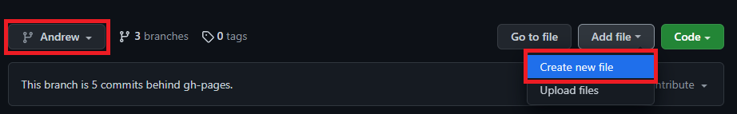
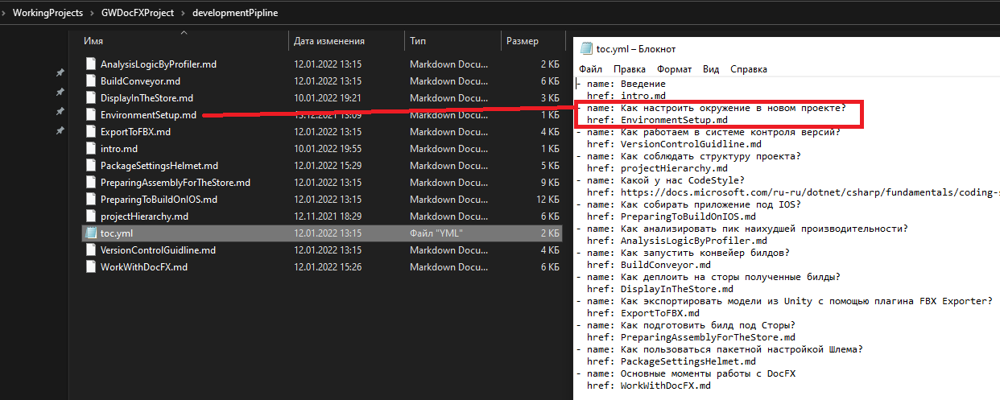
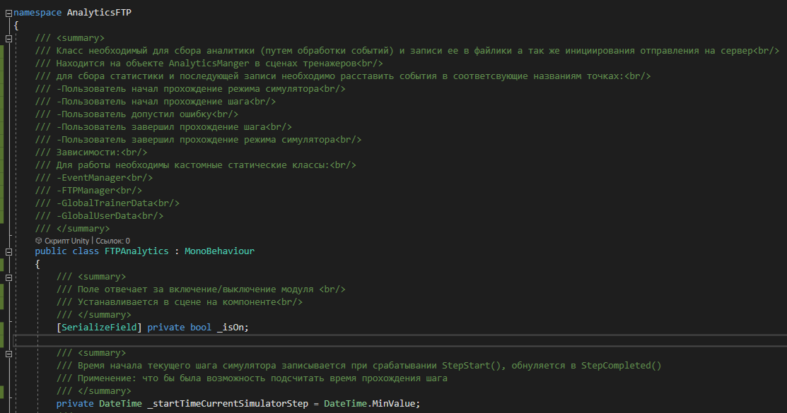
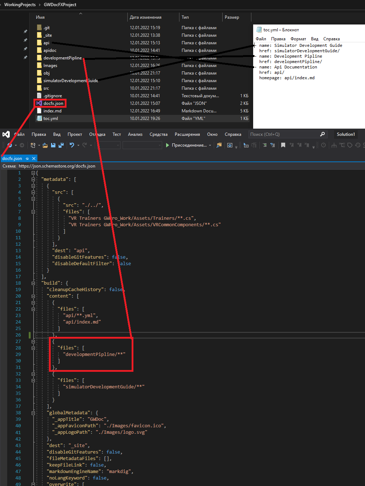
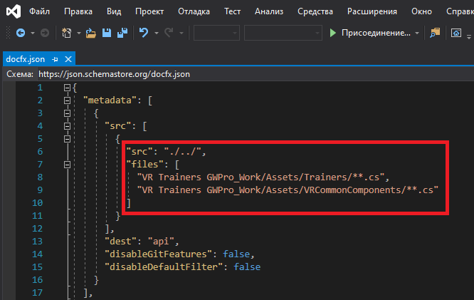

# **Правила ведения документации**

Наша документация ведется с помощью генератора статической документации DocFX
[Оффициальный сайт](https://dotnet.github.io/docfx/)

## Ответсвенности
Существует два уровня ответсвенности:
- программисты
- менеджер ответсвенный за документацию

***Ответсвенности программистов:***

- добавляют новые статьи в существующих категориях проекта документации
- для автоматизированного документирования API при создании скриптов во время работы обязательно описывают блок ///summary к каждому полю и методу и <br/> после перехода на новую строку в комментариях для красоты оформления в API
- посылают PullRequest
- делают запросы и предложения по созданию новых категорий в документации к менеджеру.

***Ответсвенности менеджера по документации:***
 
- принимает PullRequest от программистов
- создает новые категории в документациях по запросам,
- обновляет API скриптов в документации из последнего коммита в ветке Development
- билдит сайт документации с необходимыми настройками
- размещает сайт с документацией 

## Пайплайн обновления текущей документации выглядит так:

***Программисты:***

В проект документации (не путать с готовым статическим сайтом документации)
[Проект документации](https://github.com/Goldfinchworks/GWDocFXProject)
- вносим новые статьи 
- создаем PullRequest 

***Менеджер ответсвенный за документацию:***

В проект документации (не путать с готовым статическим сайтом документации)
[Проект документации](https://github.com/Goldfinchworks/GWDocFXProject)
- принимает PullRequest
- определяет места подгрузки API, если необходимо его обновить
- создает META файлы для индексации статей и API
- билдит статический сайт документации
В проекте готового статического сайта 
[Проект статического сайта](https://github.com/Goldfinchworks/GWDoc)
- добавляем все изменения(путем добавления ранее собраного сайта)

## Как вносить новые статьи (для программиста)

Стьти можно создать только в определнных категориях на данный момент есть 
- DevelopmentPipline: Здесь описаны используемые инструменты и особенности разработки проекта в нашей команде,
- SimulatorDevelopmentGuide: Здесь собраны статьи с правилами геймдизайна по разработке тренажеров,
- InternalAssets: Здесь собраны статьи внутренних ассетов, от старой документации, разработанных нашими программистами.

```
Категория API создается автоматически при билде менеджером ответсвенным за документацию из последней версии Development ветки проекта.
```
 
1. Каждый пользователь работает в своей одноименной ветке в проекте документации. [Проект документации](https://github.com/Goldfinchworks/GWDocFXProject)
2. Для любых изменений или добавлений статей создается PullRequest(из своей ветки в мастер)
3. Каждый PR просматривается, обсуждается в коментариях к нему и добавляется модератором документации
4. При создании новой страницы добавляем файл формата **.md** :exclamation: т.к по дефолту гит создает файл без формата :exclamation: в репозиторий в своей ветке прямо на GitHub



``` Если нужно добавить файл в папку, то перед ним через слеш пишем название файла который нужно создать ```
  
5. Пишем статью в созданом файлике применяя разметку MarkDown
[Ссылка на шпаргалку по разметке Markdown](https://habitica.fandom.com/ru/wiki/%D0%A8%D0%BF%D0%B0%D1%80%D0%B3%D0%B0%D0%BB%D0%BA%D0%B0_%D0%BF%D0%BE_Markdown)

6. :exclamation: Обязательно указываем ссылку на статью и ее название в файлике toc.yml соответсвующего раздела которые разбиты по одноименным папкам


7. По окончании оформления делаем PullRequest из своей ветки в ветку "gh-pages"

## Стиль оформления скриптов:
1. У каждого поля или метода стараемся прописывать блок ///summary
2. Разделяем новую строку комментария тегом <br/> для лучшей читаемости в документации
3. Описание класса должно содержать 
	- если это MonoBehaviour то на каких объектах он висит в сцене 
	- если внутри используются события для EventManagerа то в каких местах они должны вызыватся (EventTrigger с этим событием происходить)	
	- в подпункте зависимости должны находится все статические классы которые вызываются далее по коду так как не статические и так видно в объявлениях одноименных полей или в Start, Awake  а вот статические трудно угадать
4. Описание метода должно содержать
	- если он висит на объектах подобных кнопкам (если нужно переносить на сцене Drag and Drop то нужно указать куда должны быть перенесены) иначе в последствии по рошествии времени останется лишь гадать где это все весело 
	- параметры
	- возвращаемые значения
4. Описание поля должно содержать
	- зачем нужно это поле (обоснование каждого поля должно спровоцировать программиста на как можно меньшее их использовании к примеру в некоторых случаях можно использовать локальную переменную что поможет сократить ресурсы GC)



## Стиль оформления статей:

1. Для оформления названия страниц следует использовать стиль H1 (в MD эквивалент \#) и Bold (\*\*)
2. Оформление названия каждой следующей (вложеной) главы следует уменьшать на один пункт заголовка H2 (в MD \#\#) и.т.д
3. Все используемые картинки кидаем в папку Images и именуем их по названию файла статьи и порядковому номеру картинки (для порядка)

## Как добавлять новые категории (для менеджера ответсвенного за документацию)

При необходимости добавления новых категорий необходимо в корне проекта поправить файлик toc.yml обозначив в нем название категории и ссылку на нее
добавить в настройки билда docfx.json созданные категории


## Порядок сборки сайта документации (для менеджера ответсвенного за документацию)

При необходимости актуализировать сайт с документацией (интервал обновления определяется Проект менеджером)

Порядок действий:
- Проверяем наличие PullRequest если есть те которые готовы к принятию, принимаем.
- Проверяем путь (если нужно изменяем) к скриптам проекта в файлике docfx.json. Мы должны собирать все скрипты из категории и их подкатегорий папок Trainers и VRCommonComponents. Для этого необходимо скачать себе актуальный репозиторий проекта

параметр src - позволяет изменять каталог на диске относительно текущего положения корня проекта документации
- Запускаем сборку метаданных проекта для индексации с помощью команды CMD docfx metadata, команда должна быть вызвана из корня проекта
- После успешной сборки метаданных запускаем билд сайта с помощью команды CMD docfx docfx.json, команда должна быть вызвана из корня проекта
- После успешного билда можно проверить работу сайта на локальном сервере с помощью команды CMD docfx serve _site 
- Проверяем работоспособность сайта командой CMD stop останавливаем работу локального сервера
- Заливаем полученный сайт на GitHub в [Проект статического сайта](https://github.com/Goldfinchworks/GWDoc) 
- Ожидаем его Deployment время деплоя можно уточнить во [вкладке Actions](https://github.com/Goldfinchworks/GWDoc/actions)

### Общая информация по используемым технологиям в документации:
Какие действия были произведены заранее и не требуют повторения, нужны лишь при критичной ситуации, когда предется начать проект заново:
- создан проект на Github и включена функция Pages для проекта сайта 
- в проект документации в файле docfx добавлены настройки по отображению всех полей и методов и приватных и публичных по средствам параметра: «disableDefaultFilter» : true 
- в проект документации в файле docfx добавлены настройки по индексированию статей по средствам параметра: "postProcessors": [ "ExtractSearchIndex" ]
- в проект документации в файле docfx добавлены элементы брендирования лого GW, ico и Title GWDoc  по средсвам параметров: 
```
"globalMetadata": {
      "_appTitle": "GWDoc",
      "_appFaviconPath": "./Images/favicon.ico",
      "_appLogoPath": "./Images/logo.svg"
```
Для форматирования документации используется Markdown (далее MD) — облегчённый язык разметки
[Ссылка на документацию MarkDown](https://daringfireball.net/projects/markdown/syntax)


