# Чеклист по оптимизации виртуальной сцены для мобильной платформы HTC Vive Focus Plus

- Общее кол-во полигонов не более 200 000 (200к)
- Все шейдеры, использующиеся на моделях, мобильные
- Нет коллайдеров на объектах, с которыми не может быть взаимодействия
- Occlusion Culling запечен (https://docs.unity3d.com/ru/530/Manual/OcclusionCulling.html)
- Все статичные объекты в сцене помечены как статичные
- Свет запечен (См. инструкцию по запеканию света)
- Нет динамических источников света
- Все стены всегда отрисовываются первыми (чтобы ненужные объекты за стенами не прошли тест Z-буфера)
- GPU instancing включено для материалов многих одинаковых объектов в сцене
- Все здание и все стены - один объект с одним материалом (для правильной запечки света и чтобы за ними не отрисовывались после постановки в очередь другие объекты с таким же материалом (см. офис в Пожарной безопасности)
- У всех динамических объектов отключены тени
- Для всех LOD-ов объектов (где они есть), тени запечены правильно

# Настроить Static / Dynamic batching:

Статический выставляется автоматически если объектах помечаем как Static(если мы его сами не выключили в расширенных настройках). Поэтому первым делом отмечаем всё View как Static, а после этого проходим по остальным объектам и определяем статичны ли они. Чтобы включить Dynamic batching сначала в нужно перейти в Edit>ProjectSettings>Player>OtherSettings и тут ставим галочку "Dynamic Batching". Далее нам нужно настроить материалы на объектах чтобы они могли обрабатываться как Dynamic Batching, для этого в меню Tools нажимаем на пункт “FindMaterialToDinamicButching”, после этого нажимаем кнопку “Найти материалы”, он выдаст  2 массива с списком самих материалов для оптимизации и объектов на которых они лежат. Далее вручную проверяем список этих материалов в файлах проекта и где это позволяет шейдер выставляем галочку “Enable GPU  Instancing”. После оптимизации всех материалов желательно перезапустить проект.

# Оптимизация анимации игровых объектов.

***Время реализации:***

Зависит от сложности и количества моделей в сцене. Пример: Время затраченное на изменение 4 скелетных анимаций рабочих в сцене “Работы на высоте” составило 3ч.

***Описание места оптимизации:***
 Каждый анимированный объект имеющий свою иерархию костей для анимации, на сцене будет реализован как множество вложенных GameObject (рис. 1). При воспроизведении анимации каждый GO меняет свое положение по цепочке иерархии.
-большое количество вложенных в друг друга GO в сцене. Скелет одного рабочего состоит из 59 костей = 59 GO (рис.1). 3 рабочих x 59 = 177 GO.
-изменение положений большого количества GO в рантайме (т.е. расчет их положения, в купе с расчетом вложенных в них GO ниже по иерархии).
 
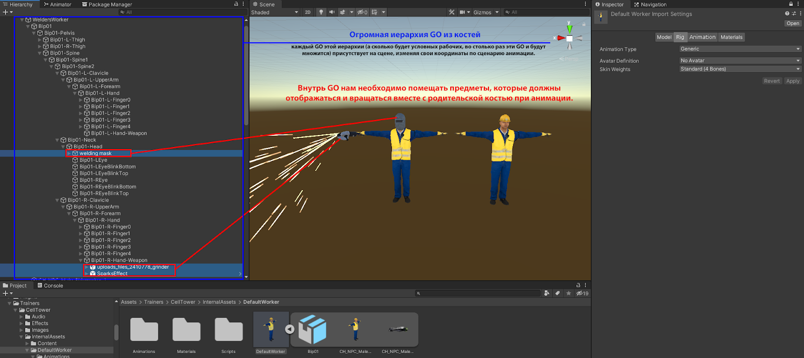

Рис.2.1 Объект с анимацией до оптимизации.

***Метод оптимизации:***
Чтобы избежать создания множества GO в сцене, существует возможность использовать аватар, который соберет в себе всю информацию о положениях костей, впоследствии изменяя ее в определенный фрейм анимации. Для этого необходимо выбрать модель во вкладке Project, после, в настройках импорта этой модели,вкладка Rig, изменить параметр “Avatar Definition” на “Create From This Model” при этом создается аватар модели для анимации(рис.2).

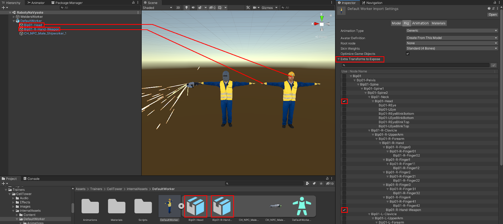
Рис.2.2 Настройки импорта.

Теперь появляется возможность использовать параметр “Optimize Game Object”. Выбрав этот параметр и перенеся объект на сцену мы можем убедится в том, что GO костей больше не создаются (Рис. 2), а аниматор работает только с назначенным аватаром. 
Настроив это, мы не можем просто так добавить предметы к скелету анимированного объекта, чтобы они двигались в соответствии с положением определенной части объекта. К примеру, у рабочего в руке должен быть газовый резак, а на голове сварочная каска. В этом случае необходимо включить отображение “костей-креплений”. В панели “Extra Transforms to Expose” (она появляется только когда включен параметр “Optimize Game Object”), нужно выбрать необходимые для управления в сцене кости. Теперь эти кости снова являются частью модели и всегда будут присутствовать в сцене.

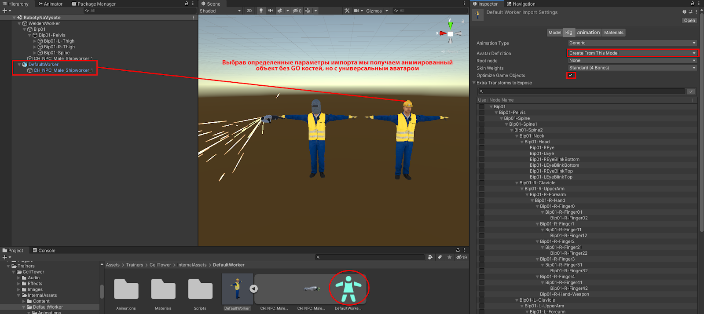

Рис. 2.3 Выделение необходимых костей из аватара на сцену

Официальная документация Unity по управлению параметрами импорта: [FBXImporter](https://docs.unity3d.com/Manual/FBXImporter-Rig.html?_ga=2.183959716.366657017.1632391125-34397027.1601835156).   
Синтетические тесты: 
GameObjects (100 шт) без применения OptimizeGameObjects: средний FPS 181 CPU: 5.5 ms (рис 2.4).
GameObjects (100шт) с применением OptimizeGameObjects:
средний FPS 220 CPU: 4.5 ms (рис 2.5)
Итого: прирост производительности примерно на 17 % по отношению к FPS и на 19% по отношению к CPU.

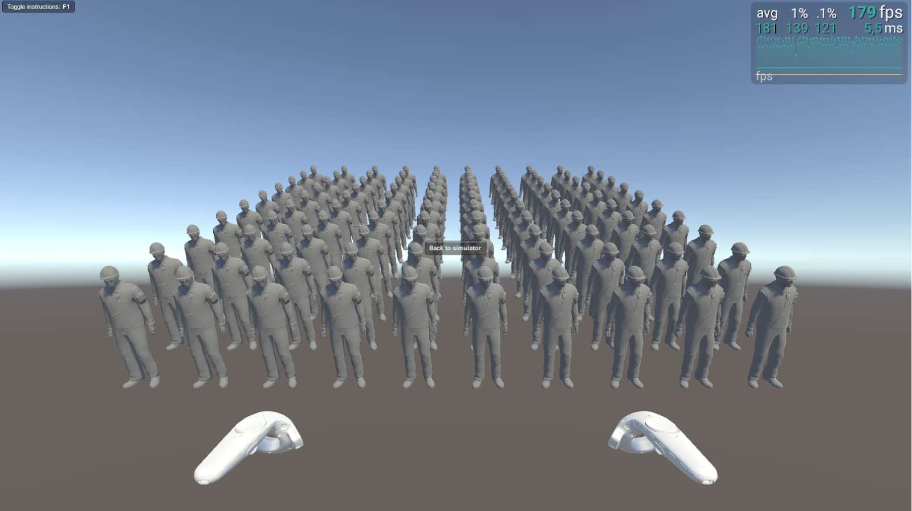

Рис. 2.4 Сцена без OptimizeGameObject

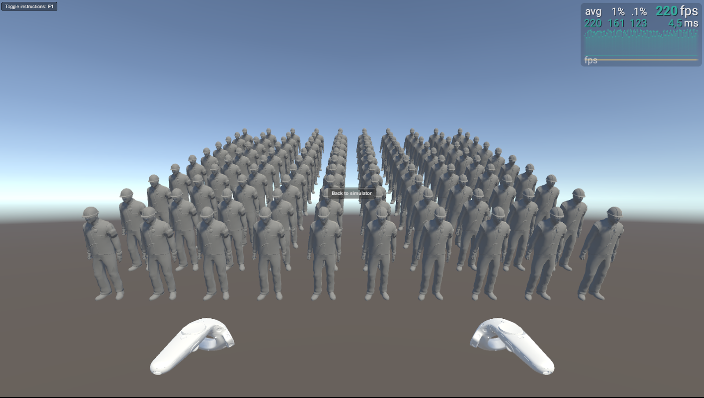

Рис. 2.5 Сцена с OptimizeGameObject

# GraphicRaycasters и Raycast Target найти и выключить: Убрать GraphicRaycasters вообще для всех UI элементов, так как он используется для отлавливания мышки(которой у нас нет) Так же убрать Canvas Raycast Target со всего кроме родительских панелей интерактивных элементов(кнопок, дропдаунов и т.п.). Со всех компонентов Text и TMP убрать галочки “Raycast Target”. Со всех Image компонентов кроме родительских панелей и самих интерактивных элементов(кнопок, дропдаунов и т.п.) также следует убрать  галочки “Raycast Target”.

# Используйте IL2CPP вместо .Net компиляции при публикации вашего приложения. Это улучшение для компиляции которая сама переводит наш C# код в C++(что увеличивает скорость взаимодействия программы с кодом) , а также оптимизирует его под целевую платформу(Android). Минусы у нее в основном в том что она увеличивает время сборки(поэтому ее рекомендуют использовать только для финальных тестов и сборки в сторы, заказчикам и т.п. ), а так же она не поддерживает некоторые сложные фишки языка C#(Которые мы скорее всего даже не используем) . И она умеет анализировать и убирать неиспользуемый системный код что уменьшает вес сборки(можно вкл/выкл по желанию). По итогу думаю стоит делать финальные билды на ней.

Список самых понравившихся мне статей по IL2CPP:

[Статья1](https://blog.unity.com/ru/technology/an-introduction-to-ilcpp-internals)
[Статья2](https://russianblogs.com/article/8255819045/)
[Статья3](https://coderoad.ru/43692235/IL2CPP-против-Mono2x-и-Android-deployment)
[Статья4](https://docs.unity3d.com/Manual/IL2CPP.html)
[Статья5](https://qastack.ru/gamedev/140493/difference-between-unity-scripting-backend-il2cpp-and-mono2x)

# Оптимизация множества мелких игровых объектов.

***Время реализации:***

Зависит от сложности и количества неоптимизированных моделей в сцене. Пример: Время затраченное на изменение моста и строительных лесов в сцене “Работы на высоте” с помощью Mesh Combine 3ч.

***Описание места оптимизации:***

Если в вашей сцене существует составной объект (состоящий из множества мелких), то имеет смысл объединить их в один объект для уменьшения количества вызовов отрисовки при попадании в один кадр. 
Метод оптимизации: нужно найти “золотую середину”, и не создавать объекты огромной длины или высоты, т.к. если большую часть времени один из концов такого длинного объекта не попадает в камеру то и нет смысла его объединять с тем из концов который находится в кадре пользователя. На иллюстрации (рис 5.1) видно что мост состоит из множества мелких реек, перил, сеток, декалей и.т.д. тут возможно стоит объединить часть моста с перилами, рамами и сеткой его пола, но при этом разделить сам мост на несколько частей, т.к. при просмотре пользователя себе на мосту он

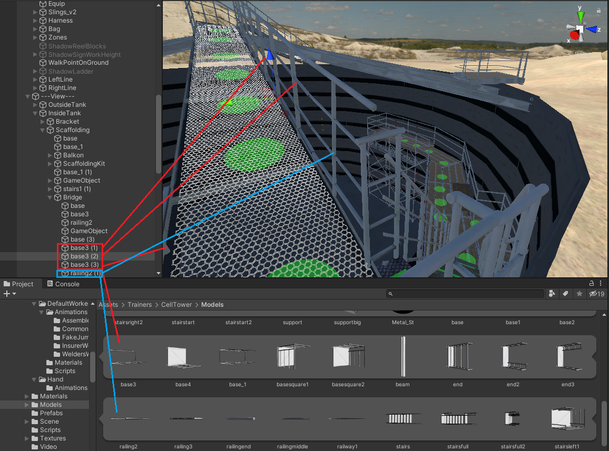 

Рис 5.1 Мост состоящий из множества мелких объектов

будет видеть перила, несущие балки, пол-решетку, но не будет видеть мост целиком, целиком объединять мост не имеет смысла(Рис. 5.2)

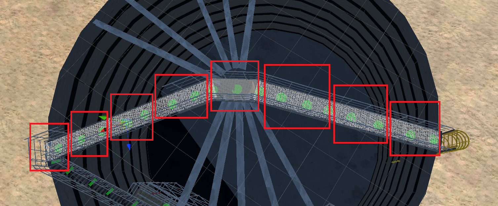

Рис 5.2 Пример желаемого разделения моста.

На иллюстрации (Рис 5.3) можно увидеть каким образом происходит Frustum culling - отсечение объектов которые не попадают в конус рендера камерой.

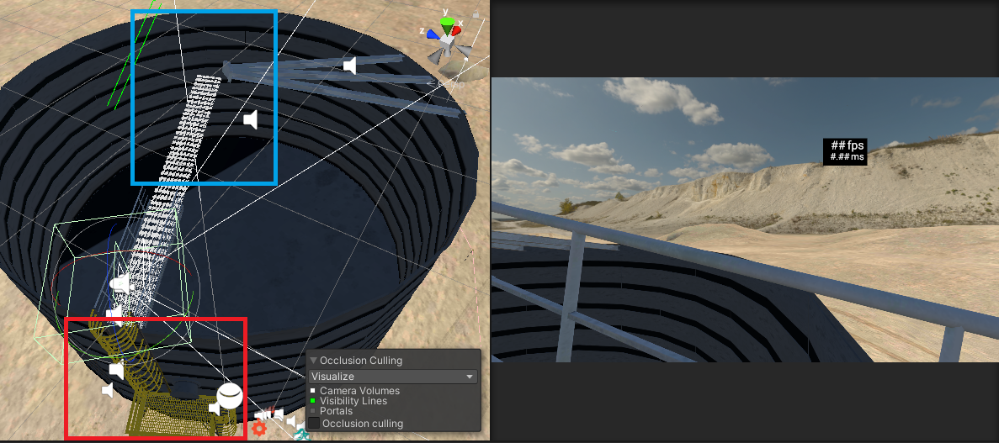

Рис 5.3 Пример отрисовывания только нужных частей.

Тут можно увидеть как правильное разделение объектов так и не правильное. К примеру лестницу (рис 5.3 красная рамка) от бака можно отделить так как она теперь будет редко попадать в кадр, но из за того что бак и лестница это единый меш она рендерится вместе с ним. А вот части моста которые не попадают в кадр не рендерятся (рис 5.3 синяя рамка).
Объединение объектов можно производить как с помощью сторонних программ для 3D моделинга (рис 5.4) так и с помощью встроенных функций и ассетов в Unity.

Рис 5.4 Пример объединения в один меш сторонней программой.

Пример работы с MeshCombiner [Ссылка на ассет](https://dotnet.github.io/docfx/) в Unity: 
для начала мы создаем пустой объект на сцене под который заносим те объекты которые необходимо слить в один меш. Добавляем на родительский объект скрипт MeshCombiner, устанавливаем необходимые настройки и нажимаем кнопку “CombineMeshes” (Рис 5.5).

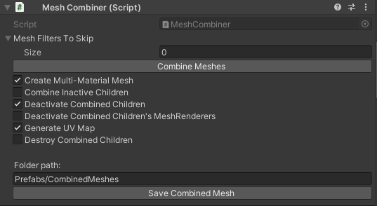

Рис 5.5 Пример настройки MeshCombiner.

Объединение таким способом незначительно медленее чем объединение в специализированном 3Д редакторе пример бенчмарков на иллюстрациях (рис. 5.7 объединение объектов с помощью MeshCombine., рис 5.8 объединение объектов с помощью Blender) На платформе Android необходимо соблюдать условие: не больше 65 000 вершин для одного объекта.

***Синтетические тесты:***

GameObjects (100 шт) без объединения: 
средний FPS 363 Batches: 216 (рис 5.6).
GameObjects (100шт) объединены CombineMeshes:
средний FPS 373 Batches:18 (рис 5.7)
GameObjects (100шт) объединены в Blender:
средний FPS 379 Batches:18 (рис 5.8).

Рис 5.6 Без объединения

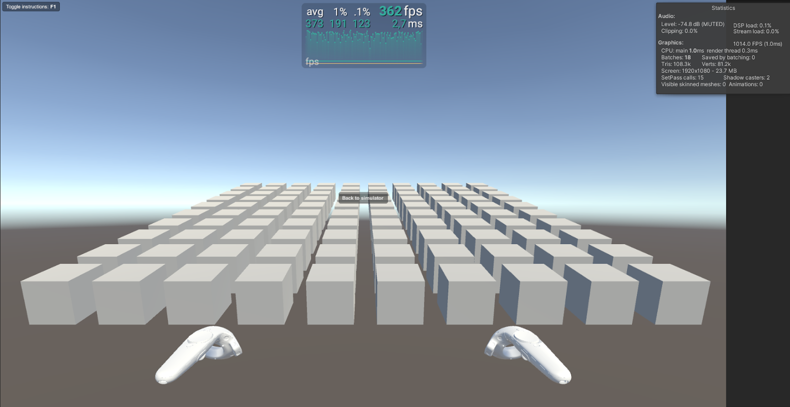

Рис 5.7 Объединение с помощью MeshCombine

Рис 5.8 Объединение с помощью Blender

# Работа с текстурами и материалами

***Время реализации: не реализовано*** 

***Описание места оптимизации:***

Объекты использующие множество материалов с различными текстурами создают лишнюю нагрузку на CPU и GPU при минимальном качестве визуализации (рис.6.1).

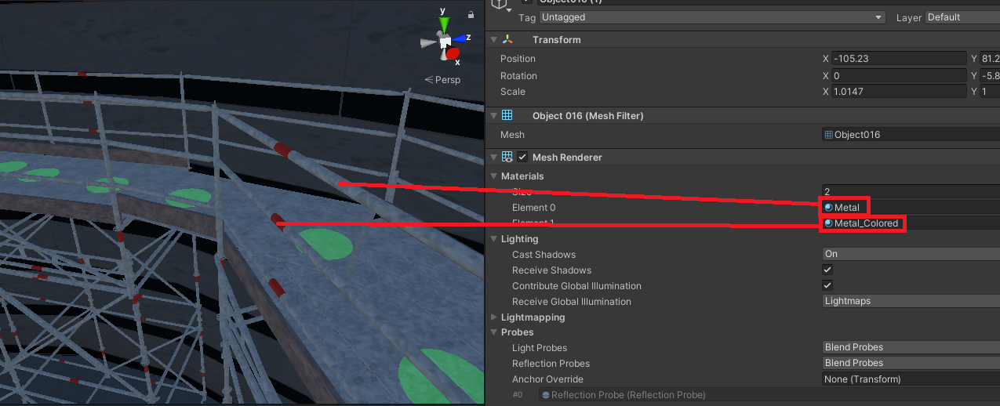

Рис 6.1 Объединение с помощью Blender

***Метод оптимизации:***

Для отображения одного статического объекта (который в ходе выполнения программы не изменяет своего облика) лучше использовать один материал с одной текстурой.
С помощью 3D редакторов можно создать UV развертку объекта,в последствии мы сможем использовать одну текстуру для одного материала. В идеале размеры текстуры и в высоту, и в ширину должны быть кратны двум: 2, 4, 8, 16, 32, 64, 128, 256, 512, 1024, 2048 и так далее. При этом они не обязаны быть именно квадратными. Например, 2048×256 — это тоже POT(Power Of Two). Если использовать текстуры не равные степени двойки NPOT (Non Power Of Two) они требуют больше памяти и медленнее считываются GPU. Размеры NPOT в интерпретации GPU считаются всегда ниже рекомендуемых значений POT. К примеру есть текстура 515×515 — это не чуть больше 512×512, а сильно меньше 1024×1024. Поэтому при ее распаковке в память вы получите второй вариант, который занимает намного больше памяти. Если нужны текстуры форматов NPOT то лучше их упаковывать в атласы, учитывая что весь атлас будет загружен в память, поэтому в атласы нужно упаковывать текстуры которые в большинстве вариантов отображаются вместе.

# Использование GraphicsAPIs Vulkan.

***Время реализации:***

 время затрачиваемое на импорт API Vulkan в проект 5-10 мин. Не реализовано

***Описание места оптимизации:***

Ускорение работы CPU, GPU за счет новых технологий. Цитата из Википедии: “Целью выпуска Vulkan было превзойти другие API, включая его предшественника OpenGL, в части снижения накладных расходов, повышения степени прямого контроля над GPU и уменьшения нагрузки на CPU.”

***Метод оптимизации:***
Переключение настроек в PlayerSettings->Player->OtherSettings->GraphicsAPIs. Иллюстрация на рисунке 6.1.

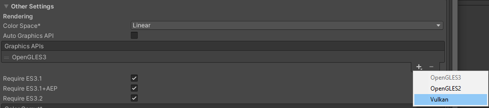

Рис 6.1 Меню выбора GraphicsAPIs

Итог: WaveXR не поддерживает Vulkan. Текст ошибки при билде: BuildFailedException: The selected grpahics API, Vulkan, is not supported by any of the current loaders. Please change the preferred Graphics API setting in Player Settings. Wave XR Loader supports: -Direct3D11 -OpenGLES3

