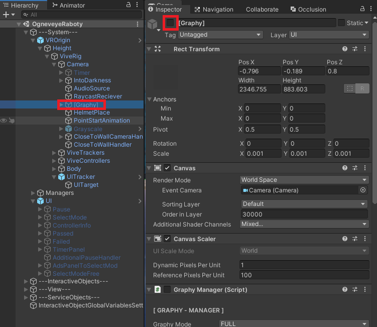
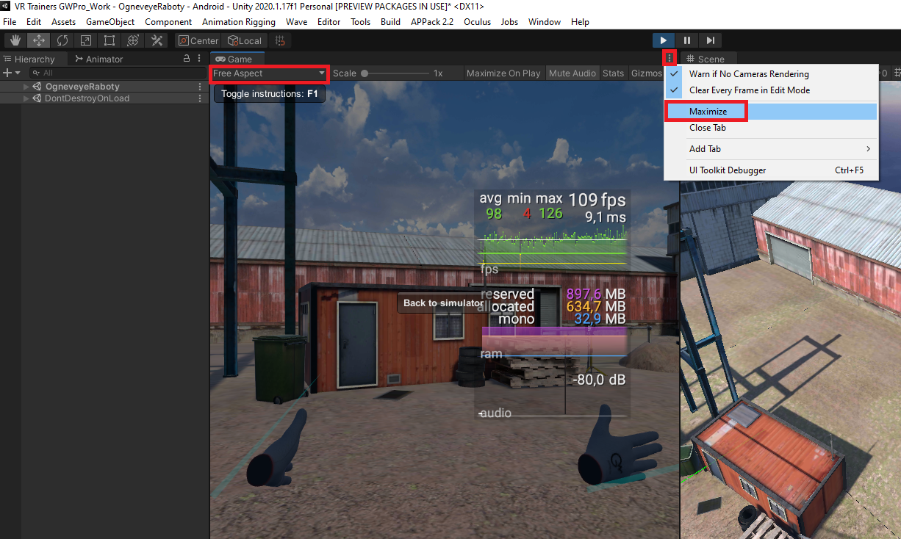

# Примерное определение целевого FPS новой сцены

При проектировании новой сцены возможна ситуация когда, определенные решения, по выбору размещаемых моделей, 
спровоцируют невозможность воспроизведения этой сцены на конечном устройстве.
Нашей целевой платформойявляется шлем "HTC Vive FocusPlus", он имеет низкую производительность среди VR-шлемов.
В связи этим, периодически, необходимо производить сверку с эталонной уже протестированной сценой (которая в указанном шлеме выдает в среднем 65-70 фпс)
Это сцена расположена: Assets/Trainers/OgneveyeRaboty/Scenes/OgneveyeRaboty.unity.

## Как проверять
- Включить компонент Graphy на эталонной сцене 


- Добавить этот компонент в свою новую сцену чайлдом к камере. Для добавления достаточно добавить его префаб из пути Assets/ExternalAssets/Graphy-UltimateStatsMonitor/Prefab/[Graphy].prefab
к себе на сцену, или скачать с помощью PackageManager пакет с одноименным названием, если создание сцены происходит не в основном проекте.
- Запустить эталонную сцену, обязательно в максимальном размере окна и свободном разрешении

- Сделать пару пролетов камерой в эталонной сцене и определить какое среднее значение FPS выдает Graphy на конкретном вашем устройстве.
- Тоже самое проделать с новой сценой

```
Пролеты камеры обязательно производить в максимальном размере окна и свободном разрешении что бы не было разночтения из за размера окна или разрешения экрана
После этих манипуляций мы получим среднее значение FPS эталонной сцены и среднее значение FPS новоиспеченной сцены на конкретно вашем устройстве в свободном разрешении и максимальном размере окна
```

- Сравнить эти данные.

	Если FPS новой сцены отличается от эталонной на 10% в большую сторону то стоит бить тревогу и задуматься о оптимизации. 