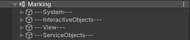

# Первоначальная настройка новой сцены (Artist)
*Сердце тренажера должно поддерживаться в чистоте :)*

**После создания новой сцены необходимо удалить с нее все имеющиеся объекты!!!**

UPD. Шаблон сцены можно взять по пути **"Assets/VRCommonComponents/Scenes/!SceneTemplate"**
Для его использования необходимо скопировать шаблон сцены, переместить в папку тренажера и переименовать в название тренажера транслитом

## Иерархия
В корне сцены должны находиться 4 пустых объекта и ничего больше:  
---System---  
---InteractiveObjects---  
---View---  
---ServiceObjects---  
Позиция и поворот данных объектов должны быть обнулены. Скаляция по всем 3-м осям равна 1

**---System---**  
Внутрь этого объекта помещаются все объекты, являющиеся ядром тренажера, а именно:
1. VROrigin
2. Всевозможные менеджеры (все менеджеры должны быть сгруппированы под пустым объектом Managers)
3. TPMain

**---InteractiveObjects---**  
Внутрь этого объекта помещаются, с которыми, явно или неявно, может взаимодействовать пользователь в процессе прохождения тренажера (Пример, газоанализатор, знак, цепь, рабочие в тренажере "Замкнутое пространство"

**---View---**  
Внутрь этого объекта помещаются неинтерактивные объекты окружения (Пример, стол, бочка, здание и прочее подобное)

**---ServiceObjects---**  
Внутрь этого объекта помещаются вспомогательные модули тренажера, освещение, звук (Пример, AudioReverbZone, коллайдеры пола, модуль CloseToWall)

Пример иерархии:  

## Порядок создания объектов на сцене

1. Создать пустой объект в корне сцены
2. Переименовать его в ---System---
3. Обнулить положение и поворот созданного объекта.
4. Проверить скаляцию созданного объекта по всем 3-м осям. Она должны быть равна 1
5. Перетащить префаб VROrigin, лежащий по пути **"Assets/VRCommonComponents/Prefabs/VROriginFinal/VROrigin"** на созданный объект. (Положение префаба настраивается при создании окружения сцены)
6. Создать пустой объект дочерним от ---System---
7. Переименовать его в Managers
8. Создать пустой объект дочерним от Managers
9. Переименовать его в EventManager
10. Повесить на него скрипт EventManager. **(ВАЖНО! Так как в проекте присутуствуют 2 скрипта с названием EventManager, необходимо убедиться, что на объект EventManager автоматически повесился скрипт DictionaryForEventManager В противном случае необходимо использовать другой скрипт)**
11. Создать пустой объект дочерним от Managers 
12. Переименовать его в AudioManager
13. Повесить на него скрипт AudioManager. **(ВАЖНО! Так как в проекте присутуствуют 2 скрипта с названием AudioManager, необходимо убедиться, что в инспекторе видно только поле TargetAudioSource. В противном случае необходимо использовать другой скрипт)**
14. В поле AudioSource перетащить камеру, лежащую по пути **"---System---/VROrigin/Height/ViveRig/Camera"** в иерархии на сцене
15. Создать пустой объект дочерним от Managers 
16. Переименовать его в TPMain (Это объект, использующийся как родитель для всех телепортов, которые будут существовать на сцене)
17. Создать пустой объект дочерним от Managers 
18. Переименовать его в LessonManager
19. Повесить на него скрипт LessonManager_V2.
20. В инспекторе в поле TeleportMainObject перетащить созданный ранее объект TPMain
21. Создать пустой объект дочерним от LessonManager
22. Переименовать его в Scenaries
23. Создать пустой объект дочерним от Scenaries 
24. Переименовать его в Prestage. **ВАЖНО! Данное название не должно изменяться!**
25. Повесить на него скрипт LessonManagerScenario_V2
26. Создать пустой объект дочерним от Scenaries 
27. Переименовать его в Learning. **ВАЖНО! Данное название не должно изменяться!**
28. Повесить на него скрипт LessonManagerScenario_V2
29. Создать пустой объект дочерним от Scenaries
30. Переименовать его в Training. **ВАЖНО! Данное название не должно изменяться!**
31. Повесить на него скрипт LessonManagerScenario_V2
32. Создать пустой объект дочерним от Scenaries 
33. Переименовать его в Exam. **ВАЖНО! Данное название не должно изменяться!**
34. Повесить на него скрипт LessonManagerScenario_V2
35. Создать пустой объект в корне сцены 
36. Переименовать его в ---InteractiveObjects---
37. Обнулить положение и поворот созданного объекта. 
38. Проверить скаляцию созданного объекта по всем 3-м осям. Она должны быть равна 1
39. Создать пустой объект в корне сцены 
40. Переименовать его в ---View---
41. Обнулить положение и поворот созданного объекта. 
42. Проверить скаляцию созданного объекта по всем 3-м осям. Она должны быть равна 1
43. Создать пустой объект в корне сцены 
44. Переименовать его в ---ServiceObjects---
45. Обнулить положение и поворот созданного объекта. 
46. Проверить скаляцию созданного объекта по всем 3-м осям. Она должны быть равна 1
47. Перетащить префаб InitPosition, лежащий по пути **"Assets/VRCommonComponents/InternalAssets/InitPosition/InitPosition"** на созданный объект. (Положение префаба настраивается при создании окружения сцены и должно быть на уровне пола в точке VROrigin)
48. В инспекторе в поле DarkScreen перетащить объект IntoDarkness, лежащий по пути **"---System---/VROrigin/Height/ViveRig/Camera/IntoDarkness"** в иерархии на сцене
