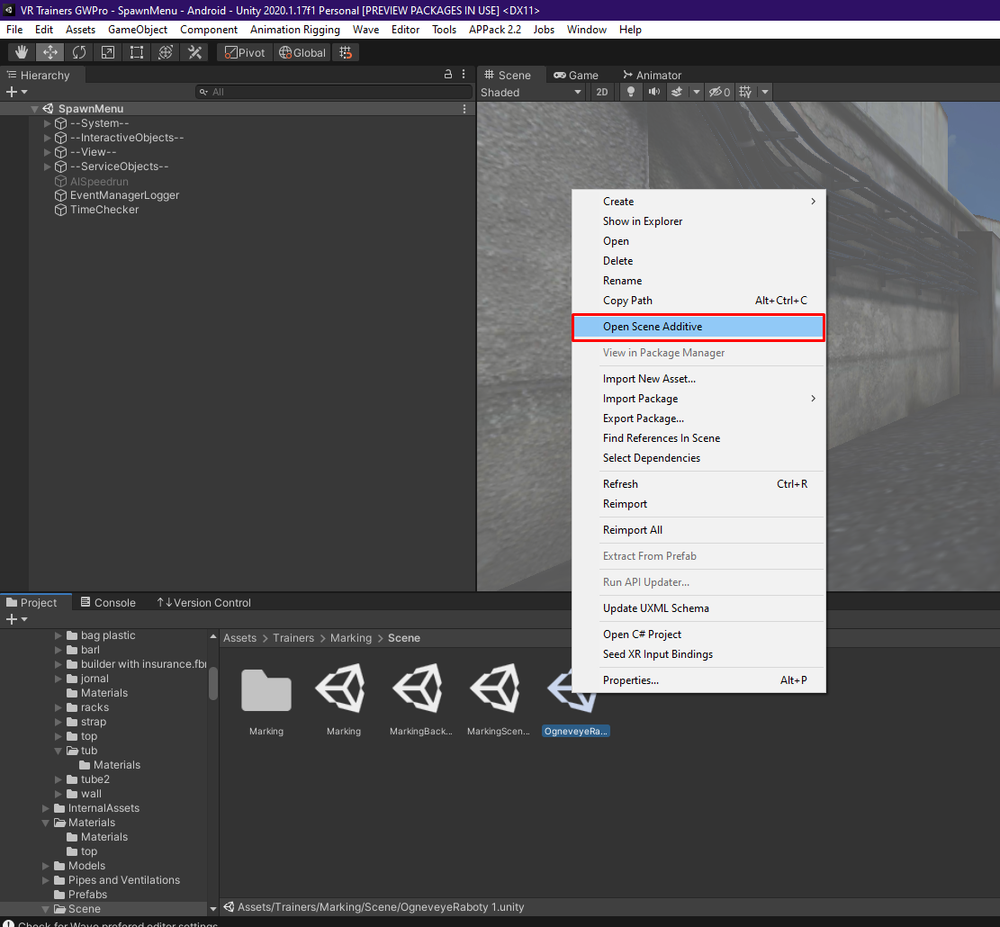

# Как работать с неинтерактивными объектами при разработке тренажера

Спустя множество проб, ошибок и боли был выведен наиболее оптимальный способ распараллелить работу художников и разработчиков 

Для работы с каждым типом объектов (интерактивные и неинтерактивные) создается своя сцена

Назовем их InteractiveScene для интерактивных и NonInteractiveScene  для неинтерактивных 

Важно, чтобы пол (точка начала тренажера) в NonInteractiveScene и VROrigin в InteractiveScene были в точке (0, 0, 0)

Для того, чтобы посмотреть как будут выглядеть сцены в слитом состоянии, необходимо нажать правой клавишей по второй сцене и выбрать "Open Scene Additive"

**ВАЖНО!!! Те, кто работает в какой-либо сцене ни при каких обстоятельствах не должны сами вносить изменения в другую без одобрения техлида проекта**

Для внесения таких изменений необходимо получить отмашку техлида либо связаться с командой и поручить такое изменение тому, кто работает в целевой ветке 

Для внесения таких изменений необходимо **ОБЯЗАТЕЛЬНО** создать под эту задачу новую ветку от основной ветки разработки тренажера при необходимости внеся в нее ранее сделанные изменения
