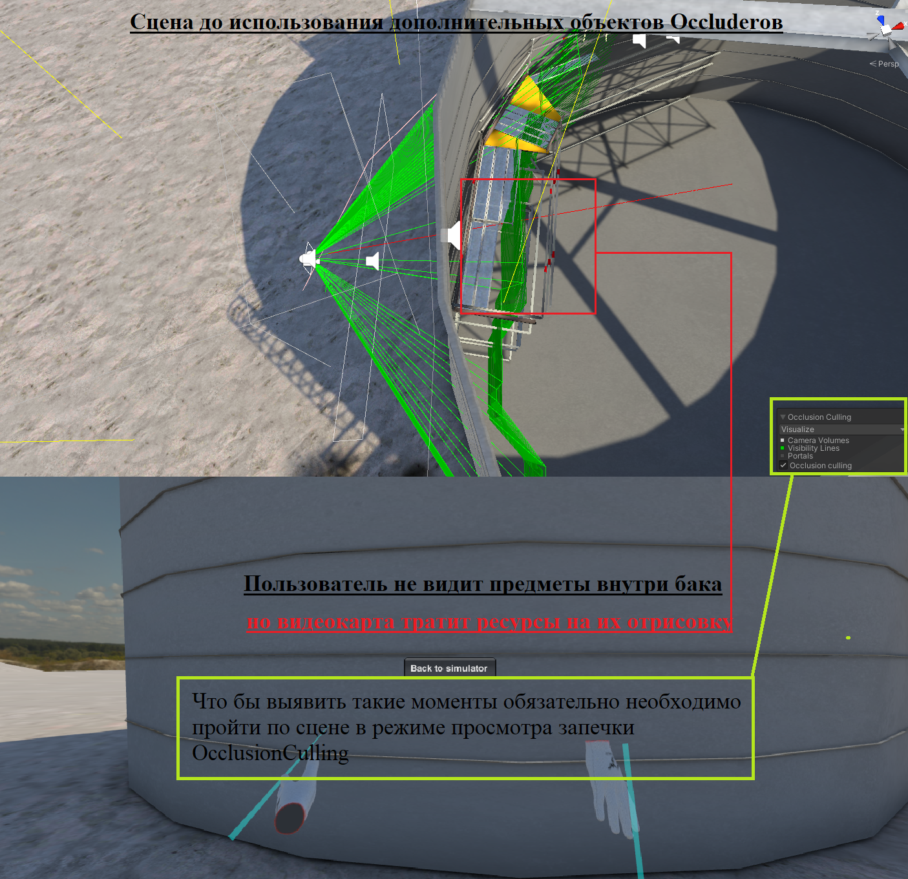

# **Особенности оптимизации с помощью OcclusionCulling (OC)**

## Пример контроля работы OC:
После запекания OcclusingCulling необходимо пройти по спорным местам на сцене и убедится в том что он правильно работает
