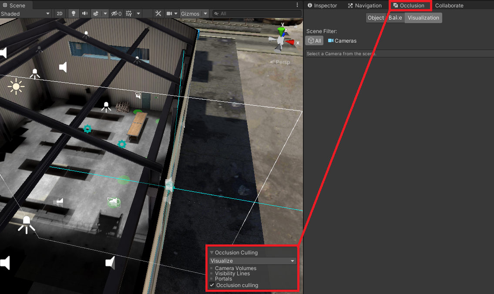
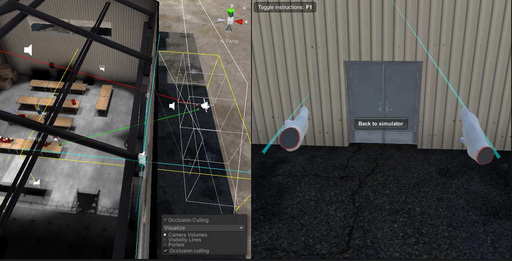
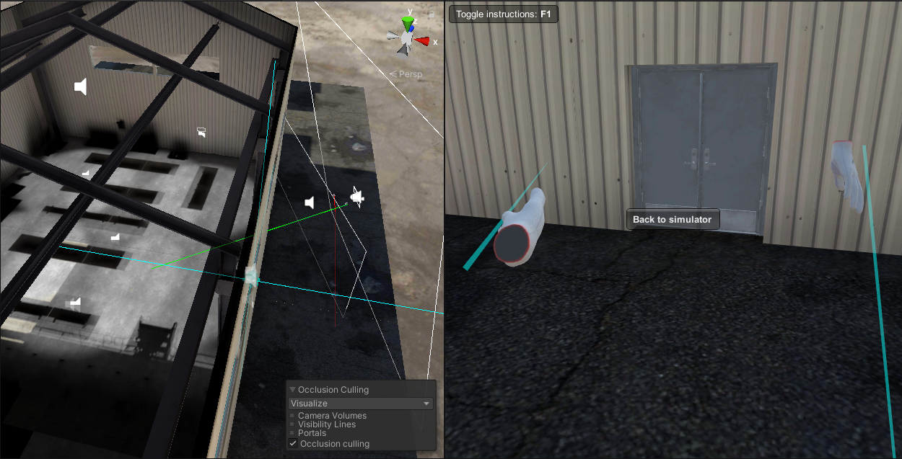

# Особенности работы с OcclusionCulling (Artist) 

[Официальная документация использования OcclusionCulling в Unity](https://docs.unity3d.com/ru/2018.4/Manual/OcclusionCulling.html)

После настройки и запекания OcclusionCulling в своем проекте, необходимо произвести проверку для обнаружения 
проблемных мест, где инструмент отработал не так как мы ожидали.

## Производим проверку

Для проведения проверки необходимо включить и перейти на вкладку окна Occlusion если его нет то добавить посредством нажатия Widows->Rendering->Occlusion Culling

После появления и становления активным вкладки окна Occlusion в окне сцены в правом нижнем углу появится вкладка OcclusionCulling необходимо поставить галочку в чек бокс с одноименным названием 


Теперь мы видим в сцене те объекты которые будут рендерится учитывая работу OcclusionCulling. 
Необходимо "пройтись" по сцене с камерой и выявить отклонения в работе OC
Они могут быть спровоцированны:
- если камера находится внутри объекта (у нас в частности в сцене Hangar, ангар это один большой объект)
- при наличии объектов с дырками в меше
- при наличии множества объектов объединенных в один меш

Тут изображен пример неправильной работы OC:



Что бы пофиксить подобный баг можно прибегнуть к такому способу(костылю):

Устанавливаем блоки на те места где подразумеваются стены, устанавливаем им статичный настройки Occlude Static, Occludee Static,
запекаем OC а после запекания удаляем/выключаем.

После подобных манипуляций работа OC станет ожидаемой



Необходимо поставить стены так что бы учитвыать двери и окна подобных стен

```
Примечание:
Оccluder-объект, который может скрыть другой объект от поля зрения (в зависимости от положения камеры).
Occludee-объект, который может быть скрыт от просмотра (потому что он закрыт другим объектом), но который сам по себе не может скрыть другой объект от просмотра.
```