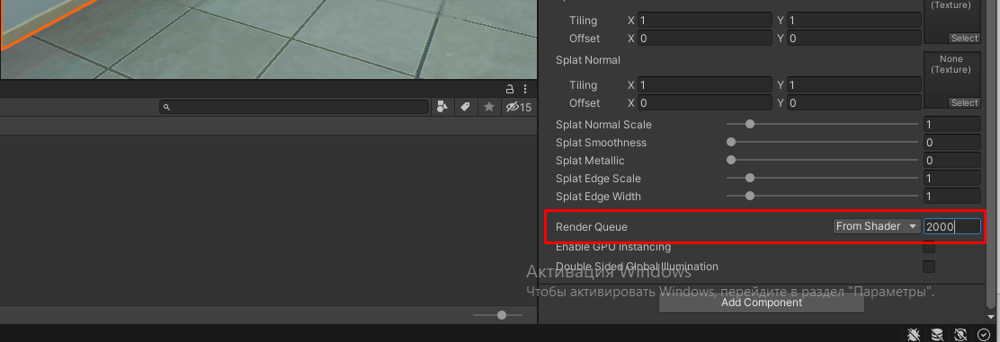

# РАЗРАБОТКА СЦЕНЫ

## Правила
1. Сцена не должна превышать 200к полигонов
2. 3д объект не должен превышать 10к полигонов
3. Проверить текстуру объекта, размера файла н должен превышать 4мб
4. Не использовать тиррейн больше чем 100м на 100м (Нужно разобраться, почему)
5. Нельзя тиррейну создавать неровности
6. Все ландшафтные неровности делать 3д объектом
7. У кустов, деревьев и травы снять галочку с Billboard в настройках Edit Grass Texture

## Инструкция
1. Изучить методику
2. Выписать объекты в «Выбор 3Д моделей для VR-тренажеров»
3. Отдать на проверку продукт-менеджер
4. Ждем покупки всех объектов, которых не хватает
5. Создаем сцену у себя на компьютере
6. Проверяем на количество полигонов
7. Отдать на проверку
8. После одобрения, создаем новую сцену в репозитории
9. Переносим все используемые объекты в новую сцену
10. Оптимизируем сцену
11. Запекаем свет

## Чеклист

### Подготовке сцены для нового тренажера
1. Алгоритмы и ассеты тренажера (см. таблицу https://docs.google.com/spreadsheets/d/19FDSJWAwDE2ar8zjWRrxY-PFgi8KgkIAvma4yldXMqI/edit#gid=0) собраны по методике
2. Схема расстановки объектов согласована с методистом
3. Найдены или отправлены в разработку все 3D модели, с которыми взаимодействуем (станки / приборы / инструменты )
4. Внешняя часть собрана / найдена / отправлена на разработку (здание, местность...)
5. Проверено, что все модели на сцене в общей сложности по количеству полигонов не превосходят 200 000. 

### Оптимизация виртуальной сцены для мобильной платформы HTC Vive Focus Plus
1) Общее кол-во полигонов не более 200 000 (200к)
2) Все шейдеры, использующиеся на моделях, мобильные
3) Нет коллайдеров на объектах, с которыми не может быть взаимодействия
4) Occlusion Culling запечен (https://docs.unity3d.com/ru/530/Manual/OcclusionCulling.html)
5) Все статичные объекты в сцене помечены как статичные
6) Свет запечен (См. инструкцию по запеканию света)
7) Нет динамических источников света
8) GPU instancing включено для материалов многих одинаковых объектов в сцене
9) Все здание и все стены - один объект с одним материалом (для правильной запечки света и чтобы за ними не отрисовывались после постановки в очередь другие объекты с таким же материалом (см. офис в Пожарной безопасности)
10) У всех динамических объектов отключены тени
11) Для всех LOD-ов объектов (где они есть), тени запечены правильно
12) Проверить, что для всего текста в TMPro проставлена галочка “Extra Padding property”
13) Все стены всегда отрисовываются первыми (чтобы ненужные объекты за стенами не прошли тест Z-буфера)
14) Пример: 
15) 

## План

### Projects in progress

Необходимые характеристики:

-- Модель в формате .fbx
-- Не больше 10000 полигонов (самый верхний предел, т.к. от кол-ва полигонов зависит производительность, а пользователь в очках VR не видит разницы между 1к полигонов и 10к), желательно наличие LOD-ов для модели (например, 500 полигонов, 1000 полигонов, 5000 полигонов)
-- стилистика реалистичная (VR тренажер, чтобы научить работников пользоваться реальным оборудованием)

Желательные характеристики:

-- PBR pipeline (текстурные карты отдельно, если они есть: normalmap, roughness map, albedo map, metallic map)
-- Запеченные текстуры 

--------------------------------------------------------------------------

1. Открыть таблицу Выбор 3Д моделей для VR-тренажеров и копировать старый лист для соответствующего тренажера, если такого еще нет
2. Переименовать лист
3. Занести все необходимые наименования моделей в столбец 1 таблицы
4. Найти модели в интернете, записываем URL ссылки в соответствующие ячейки напротив названия. Когда есть насколько вариантов, дублируем 

### Где искать

1. Unity Asset Store (ввести в строку поиска русское название, потом английское название, далее добавляем “pack” для сборок моделей )
2. Turbosquid (в параметрах поиска под Formats поставить галочку под форматом .fbx , а так же кликнуть на Rigged чтобы модель могла двигаться)
3. CGTrader 
