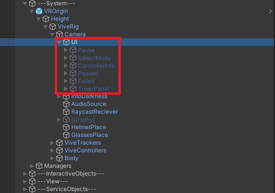
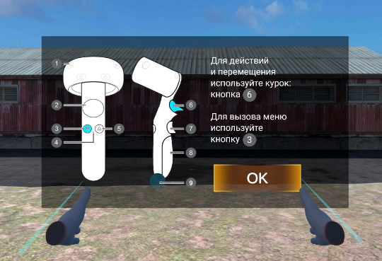
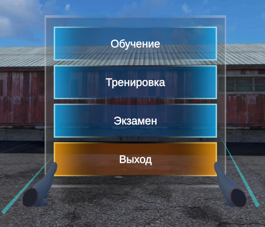
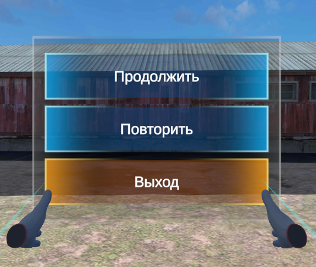
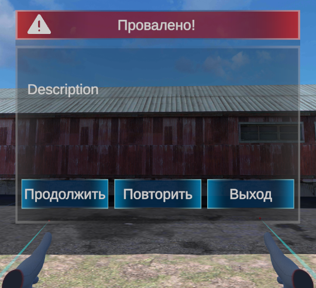
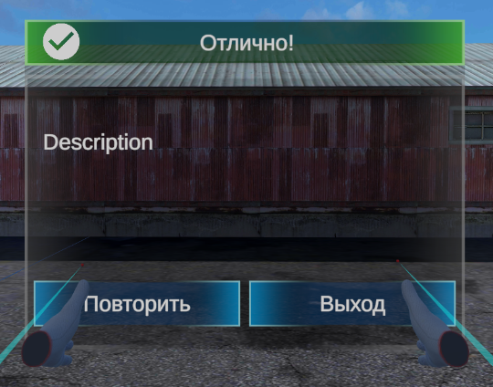
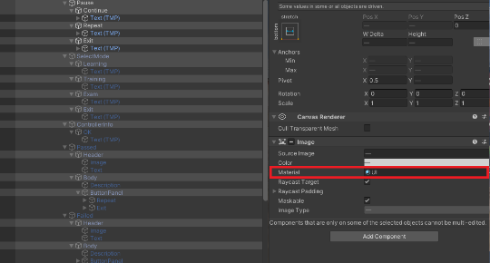
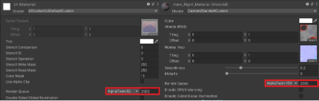
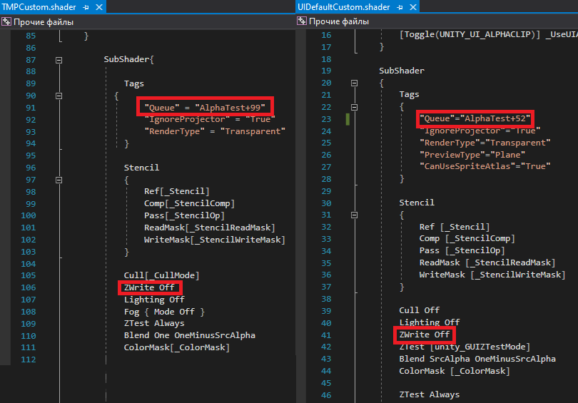

# Работа с User Interface

## Пользовательское меню

В иерархии сцены UI находится в префабе VROrigin который можно найти в VRCommonComponents, добавить на сцену и кастомизировать под целевой тренажер.

## Панель информация о контроллере (ControllerInfo)

Панель вызывается в начале любого тренажера при старте сцены в режиме Prestage, для ознакомления или напоминания о порядке пользования контроллером

## Панель выбора режима тренажера (SelectMode)

После того как пользователь ознакомился с информацией о пользовании контроллером появляется меню выбора режима тренажера.

Обучение- в этом режиме пользователю не дают совершить ошибок при прохождении тренажера

Тренировка - пользователь может допустить ошибку но нет ограничений на их количество

Экзамен - у пользователя есть определенное разрешаемое количество ошибок если он его превышает то тренажер заканчивается

## Панель меню паузы (Pause)

Панель меню паузы вызывается при нажатии на контроллере кнопки "M" при вызове тренажер останавливается.Кнопки "Продолжить" - продолжает работу в тренажере откатывая изменения которые спровоцировала допущенная ошибка, "Повторить" - вызывает меню выбора режима тренажеры для того что бы начать проходить тренажер заново.

## Панель меню поражения (Failed)

Вызывается когда игрок совершает ошибку, в теле панели появляется описание конкретной ошибки которую допустил пользователь.Кнопки "Продолжить" - продолжает работу в тренажере откатывая изменения которые спровоцировала допущенная ошибка, "Повторить" - вызывает меню выбора режима тренажеры для того что бы начать проходить тренажер заново. При превышении допустимого количества ошибок в режиме экзамена, кнопка "Продолжить" будет отсутствовать.

## Панель успешного прохождения (Passed)

Вызывается когда игрок успешно прошел тренажер, в теле панели появляется надпись описывающая какой тренажер и в каком режимы был пройдет (в дальнейшем статистика по ошибокам и.т.д). Кнопка "Повторить" - вызывает меню выбора режима тренажеры для того что бы начать проходить тренажер заново.

## Особенности панелей UI

Для того что бы панели UI отрисовывались поверх всей геометрии сцены, но позже геометрии рук пользователя  необходимо установить материал UI с кастомным шейдером(UIDefaultCustom) в котором определен порядок отрисовки, на тексте UI тоже должен быть материал с кастомный шейдером (TMPCustom)

## Порядок отрисовки (RenderQueue)

Вся геометрия - 2000

Скайбокс - 2500

UI - 2502

Руки - 2550

## Особенности шейдеров

Шейдеры UIDefaultCustom и TMPCustom обязательно должны выключать запись в Zбуффер для того что бы исключить их сравнение с другими отрисоваными объектами в диапазоне глубины камеры, тогда они будут всегда отрисовыватся поверх всего что бы то ни было, но ниже их очереди отрисовки (2502/2549 для UI и Text соответсвенно) шейдер рук (StandartCustom) напротив включает запись в ZBuffer так как должен не отрисовывать руки если их что то перекрывает в диапазоне глубины камеры
