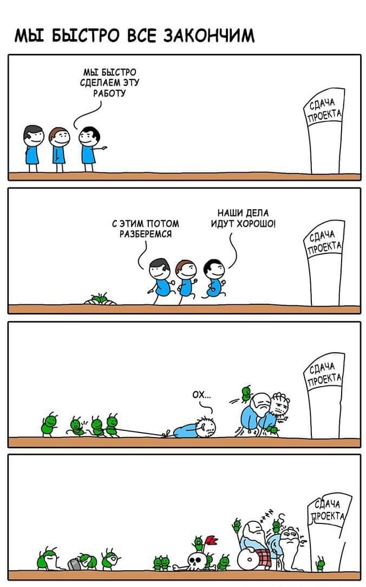

# **Гайдлайн по разработке тренажеров**

**Здесь собраны статьи с правилами геймдизайна по разработке тренажеров**

## *Основные правила по тренажерам*

1. Тренажер должен полностью проходиться в любом режиме
2. Для работы в стренажере используется только одна кнопка, курок (+кнопка "menu" только для выхода)
3. Тренажер можно пройти, не сходя с одного места
4. Для каждого действия в тренировке и экзамене есть голосовые повторяющиеся подсказки
5. В обучении и тренировке все интерактивные части объектов подсвечены в соответствующий шаг
6. Частота кадров в любой момент прохождения тренажера не опускается ниже 70 Гц для шлема Vive Focus Plus

## Какие тесты проводятся по окончании работы над тренажером:

1. Проверка производительности на протяжении всего прохождения тренажера FPS не должно падать ниже 50 пунктов
2. Позитивные тесты - проверка логики по план-схеме регламентированных действий пользователя во всех режимах 
3. Негативные(стрес) тесты - проверка отличная от сценария и ожидаемого поведения игрока, его неадекватные действия не должны критически сломать тренажер
4. Проверка наличия всех аудиоподсказок
5. Проверка наличия подсветки на всех элементах взаимодействия. В Обучении - все подсветки, в Тренировке и Экзамене должны отсутствовать

